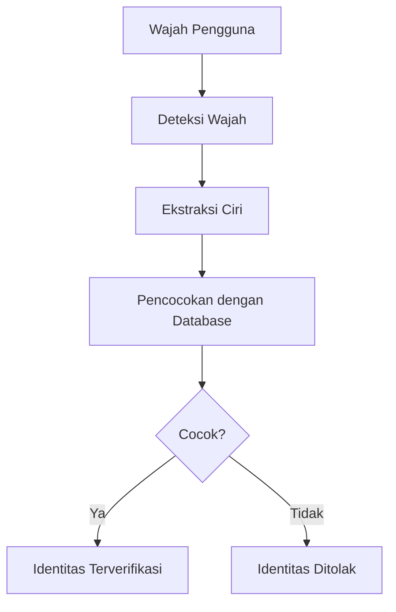
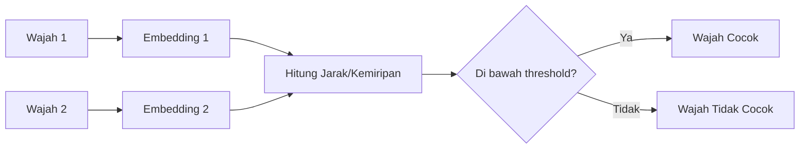
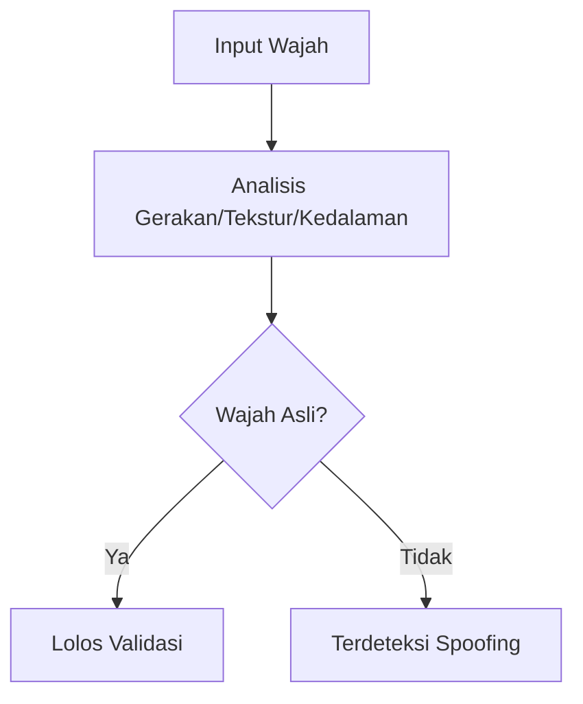
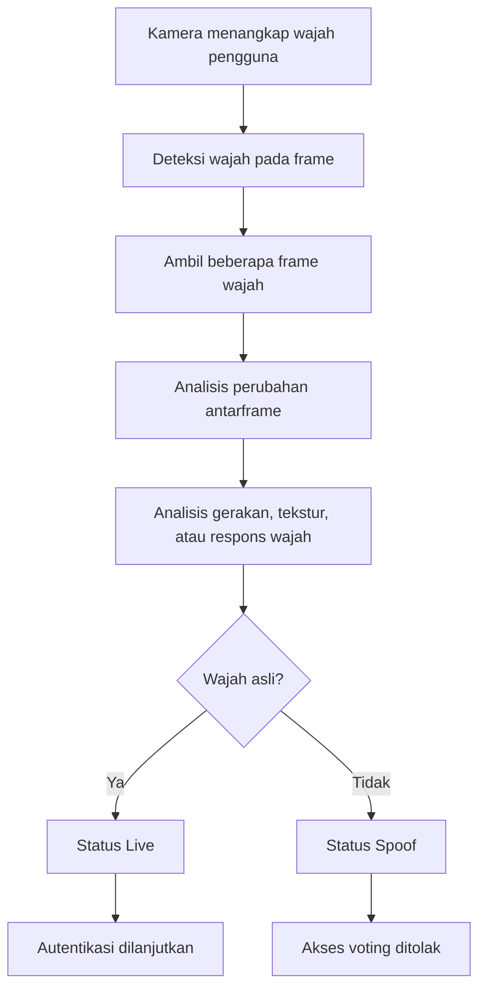
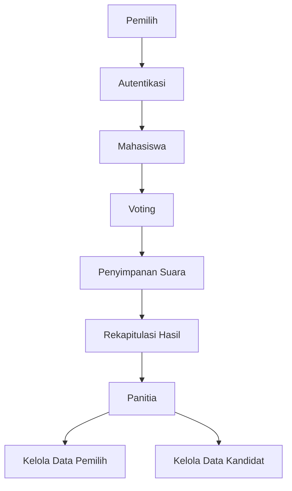
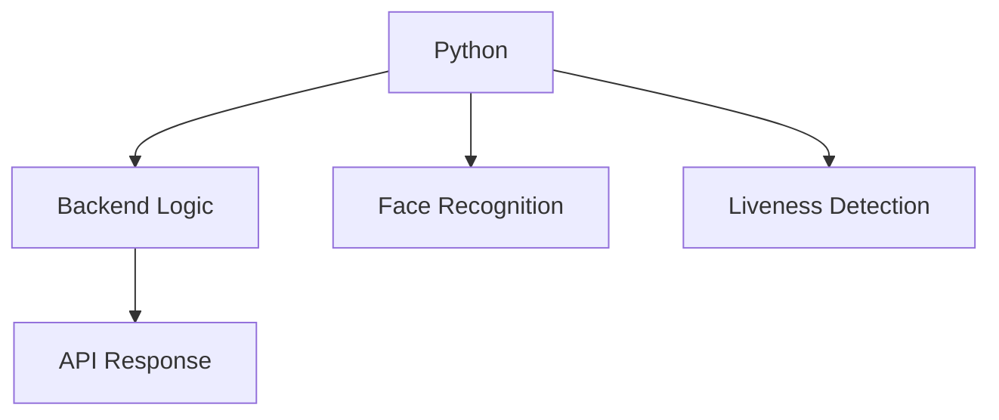
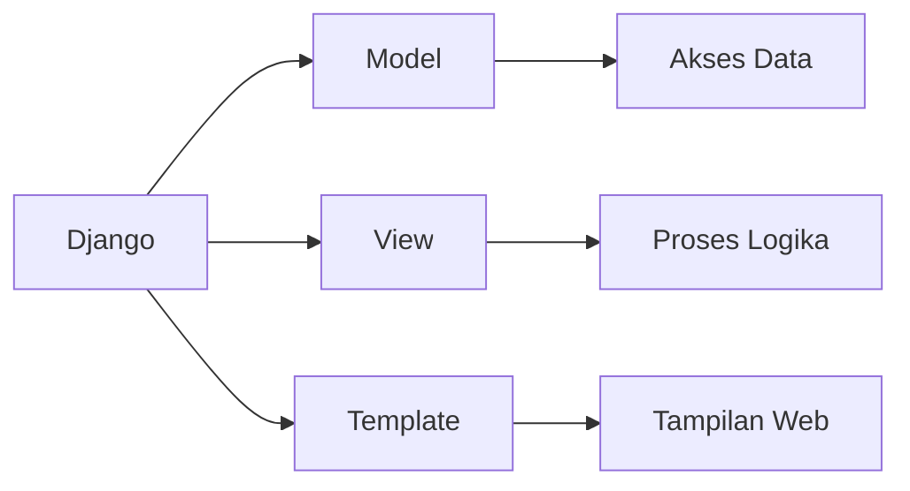
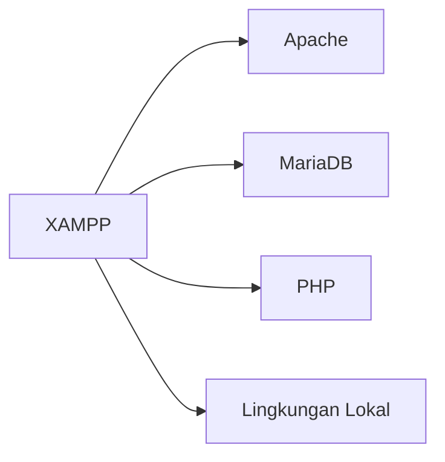
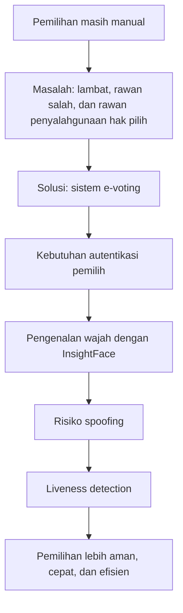
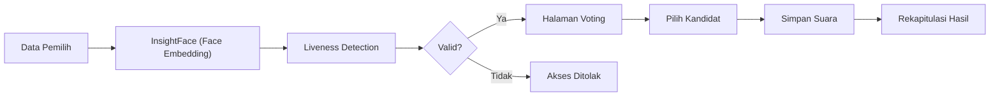

 ] # BAB II

## TINJAUAN PUSTAKA

### 2.1 Penelitian Terdahulu

Penelitian terdahulu digunakan sebagai dasar pembanding dalam pengembangan sistem *e-voting* berbasis pengenalan wajah menggunakan InsightFace dan *liveness detection*. Pada penelitian ini, referensi yang digunakan dibatasi pada publikasi **5 tahun terakhir**, yaitu periode **2022-2025**. Ringkasan penelitian yang relevan disajikan pada Tabel 2.1.

| No | Judul, Peneliti, Tahun | Hasil Penelitian | Persamaan dengan Penelitian Ini | Perbedaan dengan Penelitian Ini |
|---|---|---|---|---|
| 1 | **"Facial Recognition for Remote Electronic Voting - Missing Piece of the Puzzle or Yet Another Liability?"**, S. Heiberg, K. Krips, J. Willemson, dan P. Vinkel, 2022 [1] | Biometrik wajah berpotensi memperkuat autentikasi pada *remote e-voting*, tetapi masih memiliki risiko implementasi. | Sama-sama membahas wajah pada sistem voting elektronik. | Penelitian ini fokus pada *e-voting* organisasi mahasiswa dengan InsightFace dan *liveness detection*. |
| 2 | **"Transforming Online Voting Through Biometrics and Identity Verification"**, M. J. H. Faruk, F. Alam, M. Islam, M. A. Rahman, Y. B. Zikria, dan S. Rho, 2024 [2] | Integrasi biometrik dan verifikasi identitas meningkatkan keamanan dan keandalan *online voting*. | Sama-sama membahas autentikasi biometrik pada voting digital. | Penelitian ini lebih spesifik pada wajah berbasis *embedding* dan validasi *liveness*. |
| 3 | **"VOTUM: Secure and Transparent E-Voting System"**, J. Egocheaga, W. Angulo, dan C. Salas, 2024 [3] | Sistem *e-voting* menekankan keamanan, transparansi, dan verifikasi pengguna. | Sama-sama mengembangkan sistem *e-voting*. | Penelitian ini lebih menitikberatkan pada autentikasi wajah dan keaslian wajah. |
| 4 | **"Lightweight Face Recognition-Based Portable Attendance System With Liveness Detection"**, N. Surantha dan B. Sugijakko, 2024 [4] | Pengenalan wajah dan *liveness detection* dapat diterapkan secara ringan dan efektif. | Sama-sama menggunakan wajah dan *liveness detection*. | Penelitian tersebut untuk absensi, sedangkan penelitian ini untuk *e-voting*. |
| 5 | **"Face Anti-Spoofing Based on Deep Learning: A Comprehensive Survey"**, H. Xing, S. Y. Tan, F. Qamar, dan Y. Jiao, 2025 [5] | *Anti-spoofing* penting untuk meningkatkan keamanan autentikasi wajah. | Sama-sama menekankan pencegahan *spoofing*. | Penelitian tersebut berupa survei, sedangkan penelitian ini bersifat implementatif. |
| 6 | **"ArcFace: Additive Angular Margin Loss for Deep Face Recognition"**, J. Deng, J. Guo, N. Xue, dan S. Zafeiriou, 2022 [6] | ArcFace menghasilkan representasi wajah yang lebih diskriminatif untuk pengenalan wajah. | Sama-sama menjadi dasar autentikasi wajah berbasis *embedding*. | Penelitian tersebut berfokus pada metode inti, sedangkan penelitian ini pada implementasi sistem. |
| 7 | **"Deep Learning for Face Anti-Spoofing: A Survey"**, Z. Yu, Y. Qin, X. Li, C. Zhao, Z. Lei, dan G. Zhao, 2023 [7] | *Deep learning* efektif untuk mendeteksi berbagai serangan presentasi pada wajah. | Sama-sama membahas keaslian wajah dalam autentikasi biometrik. | Penelitian tersebut survei metode, sedangkan penelitian ini implementasi pada *e-voting*. |
| 8 | **"The Role of Machine Learning in Advanced Biometric Systems"**, M. Ghilom dan S. Latifi, 2024 [8] | *Machine learning* meningkatkan akurasi dan keandalan sistem biometrik modern. | Sama-sama menggunakan biometrik modern sebagai autentikasi. | Penelitian tersebut membahas biometrik secara umum, sedangkan penelitian ini fokus pada wajah untuk voting. |
| 9 | **"Priority-based Multi-feature Vector Model Using Convolution Neural Network for Biometric Authentication"**, S. Madduluri dan T. K. Kumar, 2024 [9] | Representasi vektor fitur meningkatkan efektivitas autentikasi biometrik. | Sama-sama menggunakan representasi vektor fitur pada autentikasi. | Penelitian tersebut autentikasi biometrik umum, sedangkan penelitian ini fokus pada *face embedding*. |
| 10 | **"AttackNet: Enhancing Biometric Security via Tailored Convolutional Neural Network Architectures for Liveness Detection"**, A. Amerini, S. Berretti, dan D. Vitulano, 2024 [10] | Arsitektur CNN khusus meningkatkan performa *liveness detection*. | Sama-sama menekankan pentingnya *liveness detection*. | Penelitian tersebut fokus pada model CNN, sedangkan penelitian ini pada penerapan validasi keaslian wajah dalam *e-voting*. |

Berdasarkan Tabel 2.1, penelitian dalam lima tahun terakhir memperlihatkan perkembangan pada tiga arah utama. Pertama, penelitian [1]-[3] menunjukkan bahwa autentikasi digital dan biometrik semakin dipertimbangkan untuk meningkatkan keamanan dan keandalan sistem *e-voting*. Kedua, penelitian [6], [8], dan [9] menegaskan bahwa pendekatan berbasis *embedding* dan vektor fitur menjadi fondasi penting dalam sistem pengenalan wajah modern. Ketiga, penelitian [4], [5], [7], dan [10] menunjukkan bahwa *liveness detection* dan *anti-spoofing* merupakan komponen penting untuk membedakan wajah asli dari media tiruan.

Jika dikaitkan dengan penelitian ini, maka terlihat bahwa belum banyak penelitian yang secara langsung mengintegrasikan ketiga aspek tersebut dalam satu sistem yang utuh, khususnya pada konteks pemilihan Ketua Himpunan Mahasiswa Teknik Informatika. Oleh karena itu, penelitian ini diarahkan untuk mengisi celah tersebut dengan mengimplementasikan sistem *e-voting* yang memadukan autentikasi wajah berbasis **InsightFace**, validasi keaslian wajah melalui *liveness detection*, serta proses pemungutan suara digital yang lebih praktis dan terstruktur.

### 2.1.1 Research Gap

Berdasarkan penelitian terdahulu yang telah dikaji, dapat diketahui bahwa penelitian mengenai *electronic voting*, autentikasi biometrik, *face recognition*, dan *liveness detection* telah banyak dilakukan. Beberapa penelitian menitikberatkan pada peningkatan keamanan sistem *e-voting* melalui verifikasi identitas digital dan biometrik [1]-[3]. Di sisi lain, penelitian terkait *face recognition* dan *anti-spoofing* lebih banyak berfokus pada peningkatan akurasi deteksi wajah serta metode untuk membedakan wajah asli dan media palsu [4], [5].

Meskipun demikian, masih terdapat beberapa celah penelitian yang relevan dengan topik ini. Pertama, sebagian besar penelitian *e-voting* membahas sistem pemilihan dalam konteks umum atau *remote voting*, tetapi belum banyak yang secara khusus mengimplementasikan sistem *e-voting* pada skala organisasi mahasiswa, khususnya pemilihan Ketua Himpunan Mahasiswa Teknik Informatika [1]-[3]. Kedua, penelitian yang membahas autentikasi biometrik pada *e-voting* umumnya belum secara spesifik mengombinasikan penggunaan **InsightFace** sebagai metode *face recognition* berbasis *face embedding* dengan **liveness detection** sebagai mekanisme validasi tambahan [1], [4], [5]. Ketiga, penelitian mengenai *liveness detection* lebih sering berdiri sendiri sebagai kajian *anti-spoofing*, belum banyak yang mengintegrasikannya langsung ke dalam alur sistem *e-voting* yang lengkap, mulai dari registrasi pemilih, autentikasi, hingga pemungutan suara [4], [5].

Selain itu, dari sisi implementasi, masih terbatas penelitian yang menekankan penggunaan pendekatan yang relatif ringan dan praktis untuk diterapkan dalam lingkungan kampus, seperti penggunaan **InsightFace** untuk ekstraksi vektor wajah dan **OpenCV** untuk *liveness detection*. Padahal, pendekatan tersebut memiliki nilai praktis karena lebih mudah diimplementasikan pada sistem berbasis web dan lebih sesuai untuk kebutuhan organisasi mahasiswa yang memerlukan sistem sederhana namun tetap aman [4], [5], [6].

Oleh karena itu, penelitian ini diarahkan untuk mengisi celah tersebut dengan merancang dan mengimplementasikan sistem *e-voting* berbasis pengenalan wajah menggunakan **InsightFace** dan *liveness detection* menggunakan **OpenCV** pada studi kasus pemilihan Ketua Himpunan Mahasiswa Teknik Informatika. Penelitian ini tidak hanya berfokus pada autentikasi biometrik, tetapi juga pada integrasi autentikasi tersebut ke dalam keseluruhan alur sistem pemilihan agar proses pemungutan suara menjadi lebih efisien, aman, dan terstruktur [1]-[6].

### 2.2 Landasan Teori

#### 2.2.1 E-Voting

*Electronic voting* (*e-voting*) adalah sistem pemungutan suara yang memanfaatkan perangkat elektronik untuk proses pemberian suara, pencatatan data, dan perhitungan hasil. Sistem ini dirancang untuk meningkatkan efisiensi, kecepatan, dan akurasi dibandingkan metode pemilihan manual. Dalam konteks penelitian ini, *e-voting* digunakan untuk mendukung proses pemilihan Ketua Himpunan Mahasiswa Teknik Informatika agar berlangsung lebih terstruktur, transparan, dan mudah dikelola. Penelitian terkini juga menunjukkan bahwa penerapan verifikasi identitas digital pada *e-voting* dapat meningkatkan keandalan sistem dalam memvalidasi pemilih [1]-[3].

Keterangan Gambar 2.3 Diagram Konsep E-Voting

#### 2.2.2 Pengenalan Wajah

Pengenalan wajah (*face recognition*) adalah teknologi biometrik yang digunakan untuk mengenali atau memverifikasi identitas seseorang berdasarkan karakteristik wajah. Secara umum, sistem bekerja dengan menangkap citra wajah, mendeteksi area wajah, mengekstraksi ciri-ciri penting, lalu membandingkan hasilnya dengan data yang tersimpan [4], [6], [8]. Pada sistem autentikasi, pengenalan wajah digunakan karena praktis, tidak memerlukan kontak fisik, dan mudah diterapkan melalui kamera perangkat [2], [4], [8].

Keterangan Gambar 2.4 Diagram Pengenalan Wajah

#### 2.2.3 InsightFace

InsightFace adalah kerangka kerja pengenalan wajah yang digunakan untuk mengekstraksi representasi numerik wajah dalam bentuk vektor atau *face embedding*. Landasan yang banyak digunakan pada kerangka kerja ini adalah pendekatan *deep face recognition* berbasis margin angular, seperti ArcFace, yang dirancang untuk menghasilkan representasi wajah yang diskriminatif pada ruang vektor [6]. Pada implementasi sistem, wajah pengguna tidak dibandingkan berdasarkan citra mentah secara langsung, melainkan melalui vektor ciri yang mewakili karakteristik wajah. Pendekatan ini membuat proses pencocokan identitas menjadi lebih efisien dan lebih sederhana dalam pengelolaan data, karena sistem cukup menyimpan vektor wajah pengguna di basis data [6], [8]. Dalam penelitian ini, InsightFace digunakan sebagai metode utama autentikasi pemilih untuk memastikan bahwa hanya pengguna terdaftar yang dapat mengakses proses pemungutan suara.

Keterangan Gambar 2.5 Diagram Proses InsightFace

#### 2.2.4 Face Embedding

*Face embedding* adalah representasi matematis dari wajah dalam bentuk vektor berdimensi tertentu yang dihasilkan dari proses ekstraksi fitur [6], [9]. Setiap wajah yang dipindai akan diubah menjadi vektor, kemudian vektor tersebut dibandingkan dengan data referensi menggunakan ukuran jarak atau tingkat kemiripan tertentu. Jika hasil kemiripan memenuhi ambang batas yang telah ditentukan, maka identitas pengguna dinyatakan cocok. Penggunaan *face embedding* mendukung proses autentikasi yang lebih efisien karena kebutuhan penyimpanan data lebih ringan dibanding menyimpan banyak citra wajah untuk pencocokan langsung [4], [6], [9].

Keterangan Gambar 2.6 Diagram Face Embedding

#### 2.2.5 Liveness Detection

*Liveness detection* adalah metode yang digunakan untuk memastikan bahwa wajah yang dideteksi sistem merupakan wajah asli dari pengguna yang hadir secara langsung, bukan foto, video, atau media tiruan lainnya [4], [5], [7], [10]. Teknologi ini berfungsi sebagai lapisan keamanan tambahan pada sistem pengenalan wajah agar proses autentikasi tidak mudah dimanipulasi. Studi terbaru menunjukkan bahwa integrasi pengenalan wajah dengan *liveness detection* dapat meningkatkan keamanan verifikasi identitas secara signifikan [4], [5], [7], [10].

Keterangan Gambar 2.7 Diagram Liveness Detection

##### 2.2.5.1 Cara Kerja Liveness Detection

Cara kerja *liveness detection* dimulai ketika kamera menangkap wajah pengguna dalam bentuk citra atau beberapa *frame* video. Setelah wajah berhasil terdeteksi, sistem menganalisis karakteristik yang menunjukkan bahwa objek tersebut merupakan wajah asli dari pengguna yang hadir secara langsung. Karakteristik tersebut dapat berupa perubahan antarframe, gerakan kecil pada kepala, kedipan mata, perubahan ekspresi, tekstur wajah, atau respons pencahayaan yang sulit ditiru secara sempurna oleh foto dan video [4], [5], [7].

Pada penelitian ini, *liveness detection* diarahkan sebagai tahap validasi sebelum pemilih dapat mengakses halaman voting. Sistem mengambil beberapa *frame* wajah melalui kamera, kemudian memeriksa apakah terdapat variasi alami antarframe. Jika perubahan yang terdeteksi menunjukkan pola gerakan yang wajar, maka wajah dikategorikan sebagai **live** dan proses autentikasi dapat dilanjutkan. Sebaliknya, jika wajah terlihat statis atau perubahan antarframe sangat kecil, maka sistem dapat mengategorikan objek tersebut sebagai **spoof** sehingga akses voting ditolak [4], [5], [10].

Pendekatan ini tidak menggantikan proses *face recognition*, tetapi melengkapinya. *Face recognition* bertugas mencocokkan identitas pemilih berdasarkan *face embedding*, sedangkan *liveness detection* bertugas memastikan bahwa wajah yang dicocokkan berasal dari pengguna nyata yang berada di depan kamera. Dengan kombinasi tersebut, sistem dapat mengurangi risiko autentikasi palsu menggunakan foto, video, atau media tiruan lainnya [5], [7], [10].

Keterangan Gambar 2.8 Diagram Cara Kerja Liveness Detection

#### 2.2.6 Spoofing dan Anti-Spoofing

*Spoofing* adalah tindakan pemalsuan identitas untuk mengelabui sistem autentikasi. Pada sistem pengenalan wajah, *spoofing* biasanya dilakukan menggunakan foto wajah, video, atau tampilan digital lainnya agar sistem salah mengenali objek palsu sebagai pengguna yang sah [5], [7], [10]. Untuk mengatasi hal tersebut, digunakan metode *anti-spoofing* yang berfungsi mendeteksi tanda-tanda bahwa objek yang dihadapi sistem bukan wajah manusia asli. Penerapan *anti-spoofing* sangat penting dalam sistem autentikasi biometrik karena menjadi penentu keabsahan identitas pengguna [4], [5], [7].

Keterangan Gambar 2.9 Diagram Spoofing dan Anti-Spoofing

#### 2.2.7 Sistem Pemilihan Ketua Himpunan Mahasiswa

Sistem pemilihan Ketua Himpunan Mahasiswa adalah sistem yang mengelola tahapan pemilihan, mulai dari pendataan pemilih, pengelolaan kandidat, verifikasi identitas pemilih, proses pemberian suara, hingga rekapitulasi hasil. Dalam penelitian ini, fokus utama diarahkan pada tahap autentikasi pemilih dan pengamanan proses pemungutan suara agar tidak terjadi pemilih ganda, penyalahgunaan identitas, maupun akses dari pengguna yang tidak berhak [1]-[3].

Keterangan Gambar 2.10 Diagram Sistem Pemilihan Ketua Himpunan Mahasiswa

#### 2.2.8 React JS

React JS adalah pustaka JavaScript untuk membangun antarmuka pengguna yang berbasis komponen. React memudahkan pengembangan tampilan aplikasi karena elemen antarmuka dapat disusun ulang menjadi komponen kecil yang reusable, sehingga pengelolaan halaman menjadi lebih terstruktur dan mudah dipelihara [11]. Dalam penelitian ini, React JS digunakan sebagai *frontend* untuk membangun halaman login, registrasi wajah, voting, hasil, dan dashboard panitia agar interaksi pengguna dapat dilakukan secara responsif melalui peramban web.

Keterangan Gambar 2.11 Diagram React JS

#### 2.2.9 Python

Python adalah bahasa pemrograman interpretatif, interaktif, dan berparadigma multi-guna yang banyak digunakan untuk pengembangan perangkat lunak, otomatisasi, analisis data, serta pemrosesan logika aplikasi [12]. Bahasa ini dikenal memiliki sintaks yang jelas dan ekosistem pustaka yang luas, sehingga sering dipilih untuk pengembangan layanan backend dan pemrosesan citra. Pada penelitian ini, Python digunakan untuk membangun backend, menjalankan logika autentikasi wajah, serta mengintegrasikan proses *face recognition* dan *liveness detection*.

Keterangan Gambar 2.12 Diagram Python

#### 2.2.10 Django

Django adalah kerangka kerja *web* berbasis Python yang dirancang untuk mempercepat pengembangan aplikasi dengan struktur yang rapi, aman, dan mudah dipelihara [13]. Django menyediakan pola pengembangan terstruktur yang mendukung pemisahan antara model, tampilan, dan logika aplikasi sehingga cocok digunakan pada sistem yang membutuhkan pengelolaan data dan autentikasi pengguna. Dalam konteks penelitian ini, Django dipahami sebagai salah satu referensi kerangka kerja Python *web* yang relevan untuk pengembangan sistem informasi, meskipun implementasi utama penelitian ini menggunakan *backend* FastAPI.

Keterangan Gambar 2.13 Diagram Django

#### 2.2.11 MariaDB

MariaDB adalah sistem manajemen basis data relasional *open source* yang merupakan pengembangan lanjutan dari MySQL dan dirancang untuk mendukung penyimpanan data secara terstruktur, cepat, dan andal [14]. MariaDB digunakan untuk menyimpan tabel, relasi data, dan operasi SQL yang dibutuhkan dalam aplikasi berbasis web. Pada penelitian ini, MariaDB relevan sebagai landasan teori penyimpanan data karena digunakan untuk menyimpan data pemilih, kandidat, *face embedding*, status registrasi, status memilih, dan hasil voting.

Keterangan Gambar 2.14 Diagram MariaDB

#### 2.2.12 XAMPP

XAMPP adalah paket distribusi pengembangan *web* yang memudahkan pengembang untuk menjalankan Apache, MariaDB, PHP, dan Perl secara lokal dalam satu lingkungan instalasi [15]. XAMPP banyak digunakan pada tahap pengembangan karena mempermudah proses pengujian aplikasi *web* tanpa harus menyiapkan server produksi terlebih dahulu. Dalam penelitian ini, XAMPP digunakan sebagai lingkungan pendukung pengembangan dan pengujian lokal agar aplikasi dapat diuji sebelum diimplementasikan secara penuh.

Keterangan Gambar 2.15 Diagram XAMPP

### 2.3 Kerangka Pemikiran

Proses pemilihan Ketua Himpunan Mahasiswa Teknik Informatika yang masih dilakukan secara manual memiliki beberapa kelemahan, seperti proses yang lambat, potensi kesalahan pencatatan, serta peluang terjadinya penyalahgunaan hak pilih. Untuk mengatasi masalah tersebut, diperlukan sistem *e-voting* yang dapat mempercepat pemungutan suara dan rekapitulasi hasil [1]-[3].

Meskipun *e-voting* dapat meningkatkan efisiensi, sistem tetap membutuhkan mekanisme autentikasi yang kuat agar hanya pemilih yang sah yang dapat memberikan suara. Oleh karena itu, digunakan teknologi pengenalan wajah berbasis InsightFace yang bekerja dengan membandingkan vektor wajah pemilih dengan data yang telah tersimpan. Pendekatan ini mendukung proses autentikasi yang cepat dan praktis [2], [4], [6], [8], [9].

Namun, autentikasi berbasis wajah masih memiliki kelemahan terhadap serangan *spoofing*. Untuk mengurangi risiko tersebut, sistem dilengkapi dengan *liveness detection* yang bertugas memastikan bahwa wajah yang dideteksi benar-benar berasal dari pengguna yang hadir secara langsung. Dengan kombinasi pengenalan wajah dan *liveness detection*, sistem diharapkan mampu memberikan tingkat keamanan yang lebih baik [4], [5], [7], [10].

Berdasarkan pemikiran tersebut, penelitian ini mengembangkan sistem *e-voting* berbasis pengenalan wajah menggunakan InsightFace dan *liveness detection* untuk mendukung pemilihan Ketua Himpunan Mahasiswa Teknik Informatika yang lebih efisien, aman, dan akurat [1]-[10].

### 2.4 Kerangka Konseptual

Kerangka konseptual penelitian ini menggambarkan alur hubungan antara data pemilih, proses autentikasi, validasi keaslian wajah, dan proses pemungutan suara. Secara umum, konsep sistem yang dikembangkan adalah sebagai berikut:

1. Data pemilih terdaftar disimpan dalam basis data, termasuk identitas dan vektor wajah hasil ekstraksi [1], [2], [6], [8], [9].
2. Pemilih mengakses sistem *e-voting* dan melakukan proses autentikasi [1]-[3].
3. Sistem melakukan pengenalan wajah menggunakan InsightFace dengan membandingkan *face embedding* pengguna terhadap data yang tersimpan [2], [4], [6], [8], [9].
4. Sistem melakukan *liveness detection* untuk memastikan wajah yang digunakan adalah wajah asli [4], [5], [7], [10].
5. Jika autentikasi dan validasi keaslian berhasil, pemilih memperoleh akses ke halaman voting [1]-[5], [7], [10].
6. Pemilih memilih kandidat dan sistem menyimpan suara secara otomatis [1]-[3].
7. Sistem memperbarui status pemilih agar tidak dapat memberikan suara lebih dari satu kali [3], [7].
8. Hasil suara direkapitulasi secara otomatis dan dapat diakses oleh panitia [1]-[3].

### 2.5 Diagram Kerangka Pemikiran

Keterangan Gambar 2.1 Diagram Kerangka Pemikiran

### 2.6 Diagram Konseptual Sistem

Keterangan Gambar 2.2 Diagram Konseptual Sistem

## Daftar Pustaka

[1] S. Heiberg, K. Krips, J. Willemson, and P. Vinkel, "Facial Recognition for Remote Electronic Voting - Missing Piece of the Puzzle or Yet Another Liability?," in *Emerging Technologies for Authorization and Authentication*, Cham: Springer, 2022, pp. 77-93, doi: 10.1007/978-3-030-93747-8_6.

[2] M. J. H. Faruk, F. Alam, M. Islam, M. A. Rahman, Y. B. Zikria, and S. Rho, "Transforming Online Voting Through Biometrics and Identity Verification," *Cluster Computing*, vol. 27, pp. 4015-4034, 2024, doi: 10.1007/s10586-023-04261-x.

[3] J. Egocheaga, W. Angulo, and C. Salas, "VOTUM: Secure and Transparent E-Voting System," in *Proceedings of the Ninth International Congress on Information and Communication Technology*, Singapore: Springer, 2024, pp. 89-99, doi: 10.1007/978-981-97-4581-4_8.

[4] N. Surantha and B. Sugijakko, "Lightweight Face Recognition-Based Portable Attendance System With Liveness Detection," *Internet of Things*, vol. 25, art. no. 101089, 2024, doi: 10.1016/j.iot.2024.101089.

[5] H. Xing, S. Y. Tan, F. Qamar, and Y. Jiao, "Face Anti-Spoofing Based on Deep Learning: A Comprehensive Survey," *Applied Sciences*, vol. 15, no. 12, art. no. 6891, 2025, doi: 10.3390/app15126891.

[6] J. Deng, J. Guo, N. Xue, and S. Zafeiriou, "ArcFace: Additive Angular Margin Loss for Deep Face Recognition," *IEEE Transactions on Pattern Analysis and Machine Intelligence*, vol. 44, no. 10, pp. 5962-5979, 2022, doi: 10.1109/TPAMI.2021.3087709.

[7] Z. Yu, Y. Qin, X. Li, C. Zhao, Z. Lei, and G. Zhao, "Deep Learning for Face Anti-Spoofing: A Survey," *IEEE Transactions on Pattern Analysis and Machine Intelligence*, vol. 45, no. 5, pp. 5609-5631, 2023, doi: 10.1109/TPAMI.2022.3215850.

[8] M. Ghilom and S. Latifi, "The Role of Machine Learning in Advanced Biometric Systems," *Electronics*, vol. 13, no. 13, art. no. 2667, 2024, doi: 10.3390/electronics13132667.

[9] S. Madduluri and T. K. Kumar, "Priority-based Multi-feature Vector Model Using Convolution Neural Network for Biometric Authentication," *International Journal of Computational Intelligence Systems*, vol. 17, art. no. 136, 2024, doi: 10.1007/s44196-024-00533-5.

[10] A. Amerini, S. Berretti, and D. Vitulano, "AttackNet: Enhancing Biometric Security via Tailored Convolutional Neural Network Architectures for Liveness Detection," *Computers & Security*, vol. 141, art. no. 103828, 2024, doi: 10.1016/j.cose.2024.103828.

[11] React, "React: The library for web and native user interfaces," 2026. [Online]. Available: https://react.dev/. [Accessed: Jun. 7, 2026].

[12] Python Software Foundation, "General Python FAQ: What is Python?," 2026. [Online]. Available: https://docs.python.org/3/faq/general.html#what-is-python. [Accessed: Jun. 7, 2026].

[13] Django Software Foundation, "Django documentation," 2026. [Online]. Available: https://docs.djangoproject.com/. [Accessed: Jun. 7, 2026].

[14] MariaDB plc, "About MariaDB," 2026. [Online]. Available: https://mariadb.com/docs/general-resources/about/about-mariadb. [Accessed: Jun. 7, 2026].

[15] Apache Friends, "About the XAMPP project," 2026. [Online]. Available: https://www.apachefriends.org/about. [Accessed: Jun. 7, 2026].
