# BAB III

## METODOLOGI PENELITIAN

### 3.1 Jenis Penelitian

Penelitian ini menggunakan jenis penelitian **rekayasa perangkat lunak** dengan pendekatan **implementatif**. Penelitian rekayasa perangkat lunak berfokus pada proses perancangan, pembangunan, dan pengujian suatu sistem untuk menyelesaikan permasalahan tertentu secara terstruktur. Pada penelitian ini, sistem yang dibangun adalah sistem *e-voting* berbasis pengenalan wajah menggunakan InsightFace dan *liveness detection* untuk mendukung proses pemilihan Ketua Himpunan Mahasiswa Teknik Informatika.

Pendekatan implementatif dipilih karena penelitian ini tidak hanya membahas konsep secara teoritis, tetapi juga menghasilkan produk berupa sistem yang dapat digunakan secara langsung. Dengan pendekatan ini, penelitian diarahkan pada bagaimana sistem dirancang, diimplementasikan, diuji, dan dievaluasi agar mampu memenuhi kebutuhan autentikasi pemilih, proses pemungutan suara, dan rekapitulasi hasil secara efektif [1], [2].

### 3.2 Objek Penelitian

Objek penelitian ini adalah proses pemilihan Ketua Himpunan Mahasiswa Teknik Informatika yang meliputi:

1. Data pemilih yang telah terdaftar.
2. Data kandidat Ketua Himpunan Mahasiswa.
3. Proses autentikasi pemilih menggunakan pengenalan wajah berbasis InsightFace.
4. Proses validasi keaslian wajah menggunakan *liveness detection*.
5. Proses pemungutan suara secara elektronik.
6. Proses penyimpanan suara dan rekapitulasi hasil pemilihan.

Objek tersebut dipilih karena proses pemilihan ketua himpunan merupakan kegiatan organisasi yang membutuhkan sistem yang efisien, cepat, dan aman, terutama pada tahap verifikasi identitas pemilih agar tidak terjadi pemilih ganda maupun penyalahgunaan hak pilih [3]-[5].

### 3.3 Teknik Pengumpulan Data

Teknik pengumpulan data yang digunakan dalam penelitian ini adalah sebagai berikut:

#### 3.3.1 Observasi

Observasi dilakukan dengan cara mengamati secara langsung proses pemilihan Ketua Himpunan Mahasiswa Teknik Informatika yang dilaksanakan atau yang sebelumnya pernah dilaksanakan **secara manual** di lingkungan organisasi mahasiswa. Yang dimaksud dengan proses manual dalam penelitian ini adalah proses pemilihan yang masih menggunakan pencatatan identitas pemilih secara langsung oleh panitia, verifikasi data secara konvensional, pemberian suara tanpa sistem autentikasi digital, serta perhitungan hasil suara yang dilakukan secara manual.

Melalui observasi ini, peneliti mempelajari tahapan-tahapan pemilihan yang berjalan, mulai dari pendataan pemilih, proses kehadiran pemilih, verifikasi identitas, pemberian suara, hingga proses penghitungan dan rekapitulasi hasil. Selain itu, observasi juga dilakukan untuk mengetahui peran panitia dalam mengelola jalannya pemilihan, dokumen atau data apa saja yang digunakan, serta hambatan yang muncul dalam pelaksanaan pemilihan manual.

Hasil observasi digunakan untuk mengidentifikasi kelemahan pada sistem yang berjalan, seperti proses yang memerlukan waktu cukup lama, potensi kesalahan pencatatan, kesulitan dalam memverifikasi identitas pemilih secara akurat, serta kemungkinan terjadinya pemilih ganda atau penyalahgunaan hak pilih. Dengan demikian, observasi menjadi dasar penting dalam merumuskan kebutuhan sistem *e-voting* yang akan dibangun agar mampu menjawab masalah yang ditemukan pada proses manual tersebut.

#### 3.3.2 Wawancara

Wawancara dilakukan kepada **Ketua Himpunan Mahasiswa Teknik Informatika** sebagai pihak yang memahami kebutuhan organisasi dan proses pemilihan ketua himpunan. Wawancara ini bertujuan untuk memperoleh informasi secara langsung mengenai pelaksanaan pemilihan yang selama ini dilakukan, kendala yang dihadapi dalam proses manual, serta harapan terhadap sistem *e-voting* yang akan dibangun.

Melalui wawancara tersebut, peneliti menggali beberapa informasi penting, seperti alur pelaksanaan pemilihan, mekanisme pendataan pemilih, proses penentuan kandidat, cara verifikasi identitas pemilih, proses pemungutan suara, serta kebutuhan terhadap laporan hasil pemilihan. Selain itu, wawancara juga digunakan untuk mengetahui permasalahan yang sering muncul, misalnya keterlambatan proses, potensi kesalahan pencatatan, kurang efektifnya verifikasi identitas, dan kemungkinan terjadinya penyalahgunaan hak pilih.

Hasil wawancara dengan Ketua Himpunan Mahasiswa Teknik Informatika menjadi dasar dalam merumuskan kebutuhan sistem, baik dari sisi fungsi utama maupun kemudahan penggunaan. Dengan demikian, sistem yang dirancang tidak hanya sesuai secara teknis, tetapi juga relevan dengan kebutuhan nyata organisasi yang menjadi objek penelitian.

#### 3.3.3 Studi Pustaka

Studi pustaka dilakukan dengan menelaah jurnal, artikel ilmiah, buku, dan referensi lain yang berkaitan dengan *e-voting*, pengenalan wajah, InsightFace, *face embedding*, *liveness detection*, dan *anti-spoofing*. Studi pustaka bertujuan untuk memperkuat dasar teori, menentukan pendekatan yang sesuai, dan menjadi pembanding terhadap penelitian yang dilakukan [3]-[6].

### 3.4 Tahapan Penelitian

Tahapan penelitian disusun secara berurutan agar proses pengembangan sistem dapat dilakukan secara terarah. Setiap tahapan menghasilkan keluaran tertentu yang digunakan sebagai dasar untuk melanjutkan ke tahap berikutnya. Rincian tahapan penelitian ditunjukkan pada Tabel 3.1.

| No | Tahapan Penelitian | Kegiatan Utama | Hasil yang Diharapkan |
|---|---|---|---|
| 1 | Identifikasi masalah | Mengidentifikasi kelemahan pemilihan manual, kebutuhan autentikasi, dan risiko penyalahgunaan hak pilih. | Rumusan masalah dan batasan penelitian. |
| 2 | Pengumpulan data | Melakukan observasi, wawancara, dan studi pustaka. | Data kebutuhan sistem dan referensi pendukung. |
| 3 | Analisis kebutuhan sistem | Menentukan kebutuhan fungsional dan nonfungsional sistem. | Daftar kebutuhan sistem yang akan dibangun. |
| 4 | Perancangan sistem | Menyusun alur proses, use case, activity diagram, ERD, layout ruangan, dan aturan proses pemilihan. | Rancangan sistem sebagai dasar implementasi. |
| 5 | Implementasi sistem | Membangun frontend, backend, basis data, modul InsightFace, dan modul liveness detection. | Aplikasi e-voting yang dapat dijalankan. |
| 6 | Pengujian sistem | Menguji fungsi sistem, autentikasi wajah, liveness detection, dan proses voting. | Hasil pengujian terhadap fungsi utama sistem. |
| 7 | Analisis hasil pengujian | Menganalisis kesesuaian hasil implementasi dengan kebutuhan sistem. | Pembahasan kelebihan, keterbatasan, dan evaluasi sistem. |
| 8 | Penarikan kesimpulan | Menyusun kesimpulan dan saran pengembangan. | Kesimpulan penelitian dan rekomendasi lanjutan. |

Keterangan Tabel 3.1 Tahapan Penelitian

### 3.5 Diagram Tahapan Penelitian

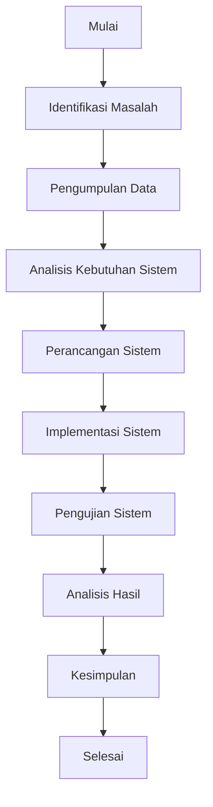

Keterangan Gambar 3.1 Diagram Tahapan Penelitian

Diagram tahapan penelitian menggambarkan urutan proses penelitian secara menyeluruh, dimulai dari identifikasi masalah hingga penarikan kesimpulan. Alur tersebut menunjukkan bahwa penelitian dilakukan secara bertahap, sehingga hasil dari satu tahap menjadi masukan untuk tahap berikutnya.

### 3.6 Metode Pengembangan Sistem

Metode pengembangan sistem yang digunakan dalam penelitian ini adalah **Waterfall**. Metode Waterfall dipilih karena tahapan pengembangan sistem dilakukan secara berurutan dan sistematis, mulai dari analisis kebutuhan hingga pengujian. Metode ini sesuai untuk penelitian yang memiliki kebutuhan sistem yang telah didefinisikan dengan cukup jelas sejak awal [1], [2].

Tahapan metode Waterfall pada penelitian ini meliputi:

#### 3.6.1 Analisis Kebutuhan

Pada tahap ini dilakukan identifikasi kebutuhan fungsional dan nonfungsional sistem. Analisis kebutuhan bertujuan untuk mengetahui fitur apa saja yang harus tersedia pada sistem, data apa saja yang diperlukan, serta batasan yang harus diperhatikan dalam implementasi sistem *e-voting* [1], [2].

#### 3.6.2 Perancangan Sistem

Tahap perancangan sistem dilakukan dengan menyusun desain proses, desain basis data, desain antarmuka, dan alur autentikasi menggunakan InsightFace dan *liveness detection*. Hasil dari tahap ini berupa rancangan yang akan menjadi dasar pada tahap implementasi [1], [2], [6].

#### 3.6.3 Implementasi

Tahap implementasi merupakan proses pembangunan sistem berdasarkan rancangan yang telah dibuat. Pada tahap ini, fitur-fitur utama seperti pengelolaan data pemilih, autentikasi wajah, validasi *liveness*, pemungutan suara, dan rekapitulasi hasil direalisasikan ke dalam bentuk aplikasi [1], [2], [4]-[6].

#### 3.6.4 Pengujian

Tahap pengujian dilakukan untuk memastikan bahwa seluruh fungsi sistem berjalan sesuai dengan kebutuhan yang telah ditetapkan. Pengujian juga bertujuan untuk mengetahui apakah autentikasi wajah, deteksi *liveness*, dan proses voting telah berjalan dengan baik [1], [2], [8].

### 3.7 Analisis Kebutuhan Sistem

Analisis kebutuhan sistem dilakukan untuk menentukan fitur, data, batasan akses, dan karakteristik teknis yang harus dimiliki oleh sistem *e-voting*. Kebutuhan ini dirumuskan berdasarkan hasil observasi, wawancara, studi pustaka, serta rancangan alur pemilihan yang telah ditetapkan [1], [2].

#### 3.7.1 Kebutuhan Fungsional

Kebutuhan fungsional sistem adalah sebagai berikut:

1. Sistem dapat menyimpan dan mengelola data pemilih.
2. Sistem dapat menyimpan dan mengelola data kandidat.
3. Sistem dapat melakukan autentikasi pemilih menggunakan pengenalan wajah berbasis InsightFace.
4. Sistem dapat mengekstraksi dan menyimpan *face embedding* pemilih pada saat registrasi.
5. Sistem dapat melakukan validasi keaslian wajah menggunakan *liveness detection*.
6. Sistem dapat menolak pemilih yang gagal pada proses pencocokan wajah atau *liveness detection*.
7. Sistem dapat memberikan akses ke halaman voting hanya kepada pemilih yang lolos autentikasi.
8. Sistem dapat membatasi setiap pemilih agar hanya dapat memberikan suara satu kali.
9. Sistem dapat menyimpan suara pemilih ke basis data.
10. Sistem dapat menampilkan hasil rekapitulasi suara secara otomatis.

#### 3.7.2 Kebutuhan Nonfungsional

Kebutuhan nonfungsional sistem adalah sebagai berikut:

1. Sistem mudah digunakan oleh panitia dan pemilih.
2. Sistem memiliki waktu respons yang memadai pada proses autentikasi wajah.
3. Sistem memiliki antarmuka yang sederhana dan mudah dipahami.
4. Data pemilih, *face embedding*, dan data suara tersimpan dengan baik di basis data.
5. Sistem mampu berjalan pada perangkat yang memiliki kamera untuk proses autentikasi.
6. Sistem memiliki mekanisme validasi yang cukup untuk mengurangi risiko penyalahgunaan identitas.

### 3.8 Perancangan Sistem

Perancangan sistem dilakukan untuk menggambarkan bagaimana sistem bekerja dari sisi pengguna, proses, data, dan perangkat pendukung. Perancangan ini mencakup hubungan aktor dengan sistem, alur pemilih, alur panitia, struktur basis data, tata letak pelaksanaan pemilihan, serta aturan operasional yang mengatur proses voting [1], [2], [6].

#### 3.8.1 Use Case Diagram

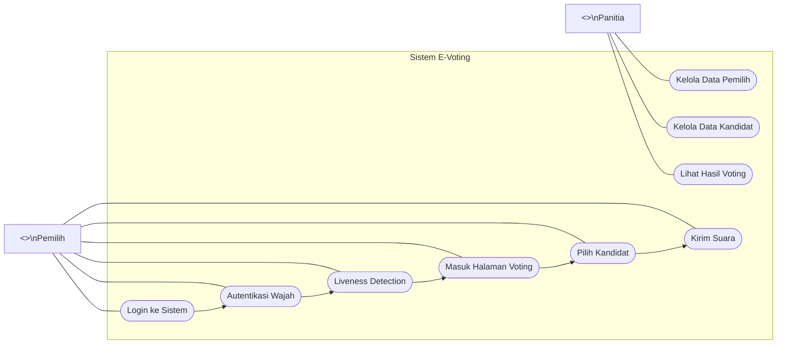

Keterangan Gambar 3.2 Use Case Diagram Sistem E-Voting

Use case diagram menggambarkan hubungan antara aktor dengan sistem. Pada sistem ini terdapat dua aktor utama, yaitu panitia dan pemilih. Panitia bertugas mengelola data pemilih, mengelola data kandidat, dan melihat hasil voting, sedangkan pemilih melakukan login, autentikasi wajah, validasi *liveness*, masuk ke halaman voting, memilih kandidat, dan mengirim suara melalui sistem. Aktor ditampilkan di luar batas sistem agar hubungan interaksi dengan setiap *use case* terlihat seperti diagram use case pada umumnya [1], [2].

#### 3.8.2 Activity Diagram Proses Voting

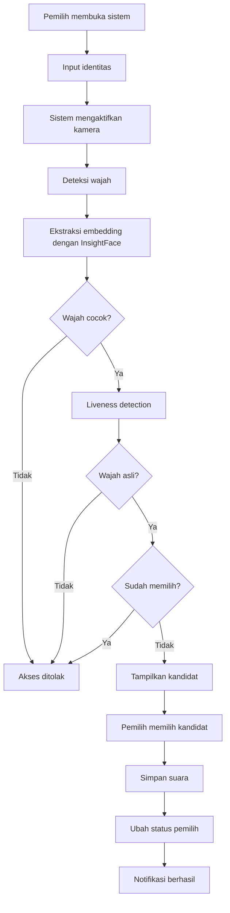

Keterangan Gambar 3.3 Activity Diagram Proses Voting

Activity diagram ini menggambarkan alur aktivitas pemilih saat menggunakan sistem. Proses dimulai dari input identitas, autentikasi wajah menggunakan InsightFace, validasi *liveness*, pengecekan status memilih, hingga proses penyimpanan suara dan pembaruan status pemilih [4]-[6].

#### 3.8.3 Flowchart Alur Pemilih

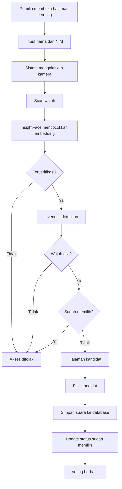

Keterangan Gambar 3.4 Flowchart Alur Pemilih

Flowchart alur pemilih menjelaskan tahapan yang dilalui pemilih sejak mengakses sistem hingga menyelesaikan proses voting. Diagram ini menegaskan bahwa hanya pemilih yang lolos autentikasi wajah, lolos validasi *liveness*, dan belum pernah memilih yang dapat memberikan suara [3]-[6].

#### 3.8.4 Entity Relationship Diagram

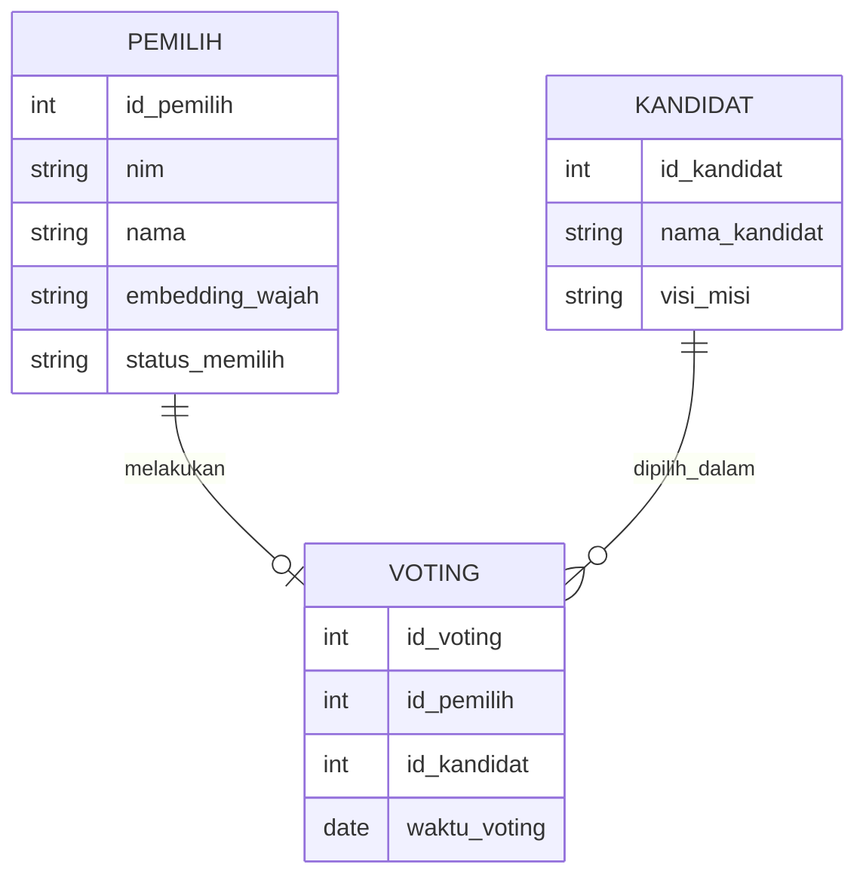

Keterangan Gambar 3.5 Entity Relationship Diagram Sistem E-Voting

Entity Relationship Diagram menggambarkan struktur data utama yang digunakan dalam sistem. Entitas **PEMILIH** menyimpan identitas pemilih dan data *embedding* wajah, entitas **KANDIDAT** menyimpan data calon ketua himpunan, sedangkan entitas **VOTING** menyimpan data suara yang telah diberikan oleh pemilih [1], [2].

#### 3.8.5 Diagram Alur Sistem Panitia

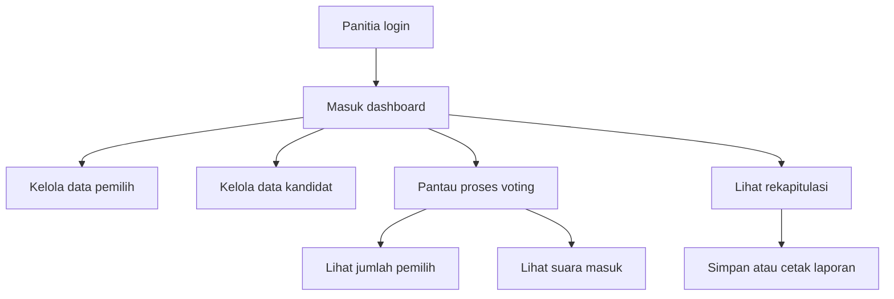

Keterangan Gambar 3.6 Diagram Alur Sistem Panitia

Diagram alur sistem panitia menunjukkan aktivitas panitia sebagai pengelola utama sistem. Panitia berperan dalam mempersiapkan data pemilih, mengelola kandidat, memantau jalannya proses voting, dan melihat hasil rekapitulasi suara [1]-[3].

#### 3.8.6 Diagram Sistem Keseluruhan

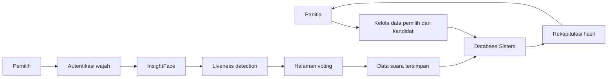

Keterangan Gambar 3.7 Diagram Sistem Keseluruhan

Diagram sistem keseluruhan menggambarkan hubungan antara panitia, pemilih, autentikasi biometrik, dan basis data dalam satu alur kerja. Diagram ini menunjukkan bahwa proses autentikasi dan penyimpanan suara terintegrasi langsung ke basis data sehingga hasil pemilihan dapat direkapitulasi secara otomatis [3]-[6].

#### 3.8.7 Layout Standar Proses Pemilihan Ketua

Untuk mendukung pelaksanaan sistem *e-voting* secara terstruktur, diperlukan layout standar proses pemilihan Ketua Himpunan Mahasiswa Teknik Informatika pada lokasi pemungutan suara. Layout ini tidak hanya berfungsi sebagai pengaturan ruang, tetapi juga sebagai rancangan alur operasional yang mengarahkan pemilih sejak datang ke lokasi hingga menyelesaikan proses voting. Dengan layout yang jelas, panitia dapat mengendalikan arus pemilih, meminimalkan penumpukan pada titik tertentu, serta menjaga agar proses verifikasi dan pemungutan suara berjalan tertib, aman, dan terdokumentasi dengan baik [1]-[3].

Secara operasional, layout pelaksanaan dibagi ke dalam beberapa zona utama, yaitu zona masuk, area antrian, meja panitia atau verifikasi awal, area autentikasi biometrik, booth voting, area monitoring hasil, dan jalur keluar. Pembagian zona ini penting agar setiap tahapan memiliki fungsi yang spesifik dan tidak saling tumpang tindih. Zona masuk digunakan sebagai titik kedatangan pemilih, sedangkan area antrian berfungsi mengatur giliran agar tidak terjadi kerumunan di meja panitia atau di booth voting. Dari area antrian, pemilih diarahkan menuju meja panitia untuk dilakukan pemeriksaan awal berupa pengecekan data identitas dan status hak pilih pada sistem [1], [2], [7].

Setelah pemeriksaan administratif selesai, pemilih diarahkan ke area autentikasi biometrik. Pada area ini dilakukan proses pengambilan citra wajah, pencocokan menggunakan InsightFace, dan validasi keaslian wajah melalui *liveness detection*. Penempatan area autentikasi sebelum booth voting merupakan bagian penting dari pengendalian akses, karena hanya pemilih yang lolos verifikasi yang dapat melanjutkan ke tahap pemungutan suara. Dengan demikian, area ini menjadi titik kontrol utama dalam menjamin bahwa hak pilih hanya digunakan oleh pemilih yang sah [3]-[6].

Booth voting merupakan zona inti tempat pemilih memberikan suara. Booth ini perlu dibuat terpisah dari meja panitia dan area autentikasi agar kerahasiaan pilihan tetap terjaga. Dalam booth voting, pemilih hanya berinteraksi dengan perangkat voting untuk melihat daftar kandidat, memilih salah satu kandidat, dan mengirim suara ke sistem. Jika jumlah pemilih cukup banyak, penyediaan lebih dari satu booth voting menjadi penting untuk mengurangi antrean dan menjaga kelancaran proses pemungutan suara [3], [7].

Selain itu, area monitoring hasil ditempatkan pada zona yang hanya dapat diakses oleh panitia. Area ini berfungsi untuk memantau status aplikasi, koneksi jaringan, aktivitas perangkat, dan perkembangan hasil voting secara real time. Area monitoring tidak digunakan untuk memengaruhi pemilih, melainkan untuk pengawasan teknis dan administratif selama pemilihan berlangsung. Apabila terjadi gangguan pada aplikasi, perangkat, atau jaringan, panitia dapat segera melakukan penanganan tanpa mengganggu booth voting secara langsung [1]-[3].

Secara keseluruhan, layout standar proses pemilihan ini dirancang berdasarkan prinsip alur satu arah, yaitu pemilih masuk melalui satu jalur, melewati tahapan verifikasi, melakukan voting, kemudian keluar melalui jalur yang berbeda. Pendekatan ini penting untuk mencegah perpotongan arus pemilih, meningkatkan efisiensi pergerakan, dan memudahkan panitia melakukan kontrol pada setiap tahap. Oleh karena itu, layout ruangan tidak hanya berperan sebagai pengaturan fisik, tetapi juga sebagai bagian dari rancangan sistem kerja pemilihan berbasis *e-voting* [1]-[3], [7].

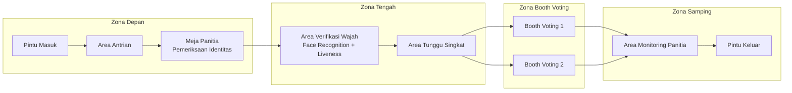

Keterangan Gambar 3.8 Diagram Layout Ruangan Pemilihan

#### 3.8.8 Letak Device pada Pelaksanaan Sistem

Selain pengaturan area proses pemilihan, letak perangkat (*device*) juga menjadi bagian penting dalam perancangan sistem. Penempatan perangkat harus disesuaikan dengan fungsi masing-masing agar proses verifikasi, voting, dan monitoring dapat berjalan secara optimal. Dalam sistem ini, perangkat utama yang digunakan meliputi laptop atau komputer panitia, kamera atau *webcam* verifikasi, perangkat voting pada booth, perangkat jaringan, dan server aplikasi atau komputer backend. Penempatan device yang tepat sangat menentukan kestabilan alur kerja sistem, karena setiap perangkat saling terhubung dalam arsitektur *client-server* [1], [2].

Laptop atau komputer panitia ditempatkan pada meja panitia sebagai pusat kendali administrasi. Perangkat ini digunakan untuk membuka dashboard sistem, memantau data pemilih, memeriksa status registrasi wajah, mengelola kandidat, serta melihat hasil voting. Posisi perangkat panitia harus mudah dijangkau oleh petugas, tetapi tidak berada di area yang dapat diakses langsung oleh pemilih agar keamanan data dan pengendalian sistem tetap terjaga [1]-[3].

Kamera atau *webcam* verifikasi ditempatkan pada area autentikasi biometrik dan diarahkan langsung ke posisi wajah pemilih. Perangkat ini digunakan untuk mengambil citra wajah saat registrasi maupun saat verifikasi sebelum voting. Penempatannya harus memperhatikan ketinggian, sudut pandang, dan pencahayaan agar hasil pengambilan citra konsisten dan dapat diproses dengan baik oleh InsightFace serta modul *liveness detection*. Dalam praktiknya, area ini sebaiknya memiliki latar belakang yang relatif sederhana agar proses deteksi wajah tidak terganggu [4]-[6].

Perangkat voting, seperti komputer, laptop, atau tablet, ditempatkan pada masing-masing booth voting. Fungsinya adalah menampilkan antarmuka pemilihan kandidat dan mengirim data suara ke backend. Penempatan perangkat voting pada booth yang terpisah bertujuan untuk menjaga privasi pemilih saat menentukan pilihan. Jika jumlah pemilih cukup banyak, maka lebih dari satu device voting dapat digunakan secara paralel untuk mempercepat proses pemungutan suara. Setiap perangkat voting harus terkoneksi ke jaringan yang sama agar dapat berkomunikasi dengan backend FastAPI dan basis data MySQL [1]-[3], [7].

Perangkat jaringan, seperti router atau titik akses jaringan lokal, diletakkan pada posisi sentral agar dapat menjangkau seluruh perangkat client dengan kualitas koneksi yang stabil. Fungsi perangkat ini adalah menghubungkan laptop panitia, kamera verifikasi, dan device voting ke backend. Sementara itu, server aplikasi atau komputer backend dapat ditempatkan pada area panitia atau ruang terpisah yang aman. Perangkat backend ini menjalankan layanan FastAPI, mengelola koneksi ke basis data MySQL, serta memproses layanan biometrik seperti InsightFace dan OpenCV. Karena memuat logika inti sistem, perangkat backend harus diletakkan pada lokasi yang aman dan tidak mudah dijangkau pihak lain [1], [2], [6].

Dengan penempatan perangkat yang tepat, sistem *e-voting* dapat dioperasikan secara lebih efisien, stabil, dan aman. Pengaturan letak device tidak hanya mendukung kelancaran proses teknis, tetapi juga membantu pemisahan fungsi antararea, menjaga ketertiban pelaksanaan pemilihan, dan mempermudah panitia dalam melakukan pengawasan serta penanganan kendala apabila terjadi gangguan selama proses voting berlangsung [1]-[3].

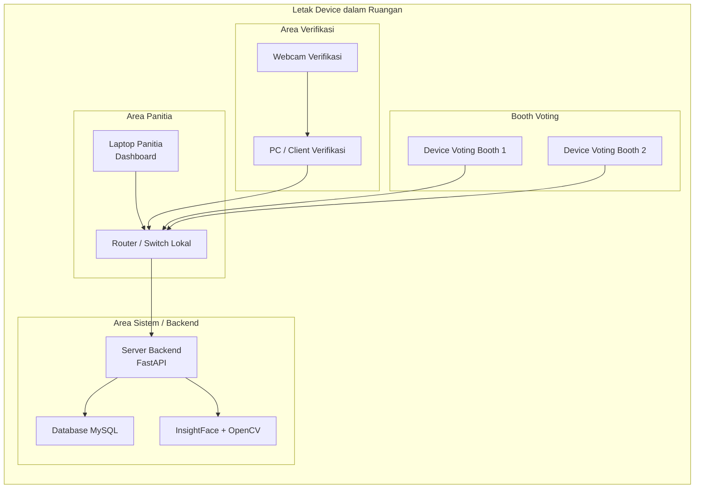

Keterangan Gambar 3.9 Diagram Letak Device Sistem

#### 3.8.9 Aturan (Rules) Proses Pemilihan

Untuk menjaga keteraturan dan keabsahan pelaksanaan *e-voting*, diperlukan aturan atau *rules* proses pemilihan yang menjadi pedoman operasional sistem. Aturan ini disusun agar seluruh tahapan, mulai dari kedatangan pemilih hingga penyimpanan suara, berjalan sesuai mekanisme yang telah dirancang dan dapat meminimalkan potensi kesalahan maupun penyalahgunaan hak pilih [1]-[3], [7].

Aturan pertama adalah setiap mahasiswa yang akan mengikuti pemilihan harus terdaftar sebagai pemilih pada sistem. Data pemilih dimasukkan lebih dahulu oleh panitia berdasarkan daftar mahasiswa yang memiliki hak pilih. Mahasiswa yang tidak tercantum dalam data pemilih tidak dapat melanjutkan ke proses voting [3], [7].

Aturan kedua adalah setiap pemilih wajib melakukan login ke sistem menggunakan identitas yang telah diberikan, yaitu NIM dan kata sandi. Login ini bertujuan untuk memastikan bahwa pengguna yang mengakses sistem merupakan pengguna yang sah sesuai data yang tersimpan pada basis data [1]-[4].

Aturan ketiga adalah pemilih yang belum memiliki data wajah pada sistem harus melakukan registrasi wajah terlebih dahulu. Pada tahap ini, mahasiswa melakukan pengambilan citra wajah dan dapat menambahkan foto kartu mahasiswa sebagai data pendukung yang bersifat opsional. Data registrasi tersebut selanjutnya dikirim ke sistem untuk diproses dan diverifikasi [4], [6].

Aturan keempat adalah data wajah yang telah diregistrasikan harus melewati proses pemeriksaan atau persetujuan panitia sebelum digunakan pada proses voting. Dengan adanya aturan ini, sistem memiliki mekanisme kontrol tambahan agar data biometrik yang digunakan benar-benar berasal dari pemilih yang sah [3], [4], [7].

Aturan kelima adalah setiap pemilih wajib melewati proses autentikasi biometrik sebelum dapat memberikan suara. Proses autentikasi terdiri atas pencocokan wajah menggunakan InsightFace dan validasi keaslian wajah menggunakan *liveness detection*. Jika salah satu tahapan autentikasi gagal, maka pemilih tidak dapat masuk ke halaman voting [4]-[6].

Aturan keenam adalah setiap pemilih hanya diberikan satu kesempatan untuk memberikan suara. Setelah suara berhasil dikirim dan tersimpan pada basis data, status pemilih akan diperbarui menjadi sudah memilih. Dengan demikian, sistem secara otomatis menolak setiap percobaan voting ulang dari pemilih yang sama [3], [7].

Aturan ketujuh adalah proses pemungutan suara harus dilakukan pada booth voting yang telah disediakan. Aturan ini bertujuan untuk menjaga ketertiban pelaksanaan pemilihan dan memastikan bahwa pemilih dapat memberikan suara secara mandiri tanpa intervensi pihak lain [3], [7].

Aturan kedelapan adalah panitia hanya memiliki hak untuk mengelola data pemilih, data kandidat, memantau sistem, memverifikasi data registrasi, dan melihat hasil voting. Panitia tidak diperkenankan mengubah isi suara yang telah tersimpan dalam sistem. Aturan ini penting untuk menjaga integritas hasil pemilihan [1]-[3], [7].

Aturan kesembilan adalah seluruh data suara yang telah masuk harus disimpan secara otomatis ke basis data dan ditampilkan dalam bentuk rekapitulasi hasil. Rekapitulasi hanya dapat diakses oleh panitia atau pihak yang berwenang sesuai kebutuhan pelaksanaan pemilihan [3], [7].

Aturan kesepuluh adalah setelah periode pemilihan selesai, data tertentu seperti data voting, data kandidat aktif, dan data operasional pemilihan dapat diatur ulang untuk persiapan periode selanjutnya. Namun, pengaturan ulang ini harus dilakukan oleh panitia dan tetap memperhatikan kebutuhan dokumentasi hasil pemilihan yang telah berlangsung [1]-[3].

Dengan adanya aturan-aturan tersebut, proses pemilihan dapat dilaksanakan secara lebih konsisten, aman, dan terstruktur. Aturan ini juga menjadi dasar pengendalian sistem agar seluruh pengguna, baik mahasiswa maupun panitia, menjalankan fungsi masing-masing sesuai prosedur yang telah ditetapkan [1]-[4], [7].

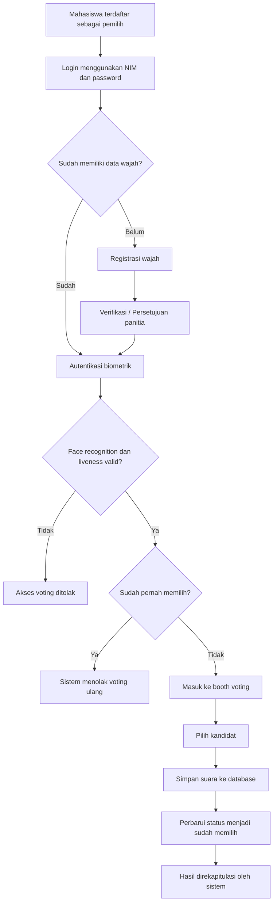

Keterangan Gambar 3.10 Diagram Rules Proses Pemilihan

### 3.9 Perangkat yang Digunakan

Perangkat yang digunakan dalam penelitian ini dibagi menjadi dua kelompok, yaitu perangkat keras dan perangkat lunak. Pembagian ini digunakan agar kebutuhan implementasi sistem dapat dijelaskan secara lebih terstruktur, mulai dari perangkat fisik yang mendukung pengembangan dan pengujian hingga perangkat lunak yang digunakan untuk membangun aplikasi *e-voting* berbasis pengenalan wajah [1], [2], [4]-[6].

#### 3.9.1 Perangkat Keras

Perangkat keras yang digunakan dalam penelitian ini disajikan pada Tabel 3.2. Daftar ini memuat perangkat utama yang diperlukan untuk menjalankan proses pengembangan, autentikasi wajah, dan pengujian sistem secara keseluruhan.

| No | Perangkat Keras | Deskripsi/Fungsi |
|---|---|---|
| 1 | Laptop atau komputer pengembangan | Digunakan untuk menulis kode program, menjalankan frontend React.js, backend FastAPI, basis data MySQL, serta melakukan pengujian sistem. |
| 2 | Kamera atau *webcam* | Digunakan untuk mengambil citra wajah pada proses registrasi wajah, autentikasi pemilih, dan *liveness detection*. |
| 3 | Perangkat voting | Digunakan oleh pemilih untuk mengakses halaman voting dan memberikan suara secara elektronik. Perangkat dapat berupa laptop, komputer, atau tablet. |
| 4 | Perangkat jaringan | Digunakan untuk menghubungkan perangkat panitia, perangkat voting, dan server backend dalam satu jaringan lokal. |
| 5 | Media penyimpanan | Digunakan untuk menyimpan file sistem, data pendukung, basis data, dan dokumen hasil penelitian. |

Keterangan Tabel 3.2 Perangkat Keras yang Digunakan

#### 3.9.2 Perangkat Lunak

Perangkat lunak yang digunakan dalam penelitian ini disajikan pada Tabel 3.3. Daftar ini mencakup lingkungan pengembangan, *framework*, pustaka pendukung, basis data, serta peramban yang digunakan selama proses implementasi dan pengujian sistem.

| No | Perangkat Lunak | Deskripsi/Fungsi |
|---|---|---|
| 1 | Sistem operasi Windows | Digunakan sebagai sistem operasi pada perangkat pengembangan dan pengujian. |
| 2 | React.js | Digunakan untuk membangun antarmuka pengguna, seperti halaman login, registrasi wajah, voting, hasil, dan dashboard panitia. |
| 3 | FastAPI | Digunakan sebagai backend untuk mengelola API, autentikasi, pengolahan data, proses biometrik, dan komunikasi dengan basis data. |
| 4 | MySQL | Digunakan untuk menyimpan data pemilih, kandidat, *face embedding*, status registrasi, status memilih, dan hasil voting. |
| 5 | InsightFace | Digunakan untuk mengekstraksi dan mencocokkan *face embedding* pemilih pada proses pengenalan wajah. |
| 6 | OpenCV | Digunakan untuk pengolahan citra dan pendukung proses *liveness detection* berdasarkan frame kamera. |
| 7 | Web browser | Digunakan untuk menjalankan dan mengakses sistem *e-voting* berbasis web. |
| 8 | Editor kode | Digunakan untuk menulis, mengubah, dan mengelola kode program selama proses pengembangan. |

Keterangan Tabel 3.3 Perangkat Lunak yang Digunakan

### 3.10 Metode Pengujian

Metode pengujian digunakan untuk memastikan bahwa sistem yang dibangun berjalan sesuai kebutuhan fungsional dan nonfungsional. Pengujian difokuskan pada fungsi utama sistem, yaitu alur login, registrasi wajah, autentikasi biometrik, validasi *liveness*, proses voting, pembatasan satu suara untuk satu pemilih, dan rekapitulasi hasil [1], [2], [8].

#### 3.10.1 Black Box Testing

*Black box testing* digunakan untuk menguji fungsi sistem berdasarkan input dan output tanpa melihat kode program secara langsung. Pengujian ini dilakukan pada fitur utama seperti login, pengelolaan data pemilih, pengelolaan kandidat, registrasi wajah, voting, dan rekapitulasi hasil. Suatu fitur dinyatakan berhasil apabila keluaran sistem sesuai dengan skenario yang telah ditentukan [2], [8].

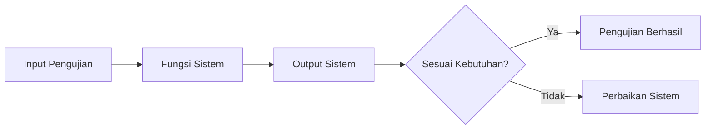

Keterangan Gambar 3.11 Diagram Black Box Testing

#### 3.10.2 Pengujian Autentikasi Wajah

Pengujian autentikasi wajah dilakukan untuk mengetahui kemampuan sistem dalam mengenali pemilih yang telah terdaftar berdasarkan *face embedding* yang tersimpan di basis data. Pada pengujian ini, sistem mengambil citra wajah melalui kamera, mengekstraksi *embedding* menggunakan InsightFace, kemudian membandingkannya dengan data wajah pemilih yang sudah tersimpan. Pengujian juga dilakukan untuk memastikan bahwa wajah yang tidak sesuai tidak dapat melanjutkan ke proses voting [4], [6].

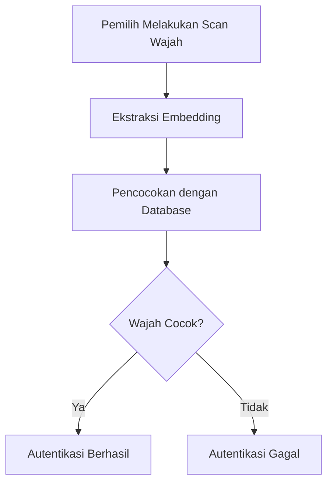

Keterangan Gambar 3.12 Diagram Pengujian Autentikasi Wajah

#### 3.10.3 Pengujian Liveness Detection

Pengujian *liveness detection* dilakukan untuk mengetahui kemampuan sistem dalam membedakan wajah asli dari media palsu seperti foto atau video. Pada pengujian ini, sistem membaca beberapa frame dari kamera dan menganalisis perubahan yang muncul antarframe. Jika variasi frame menunjukkan adanya aktivitas alami, maka wajah dikategorikan sebagai *live*. Jika wajah cenderung statis atau tidak memenuhi kriteria validasi, maka sistem menolak autentikasi [4], [5].

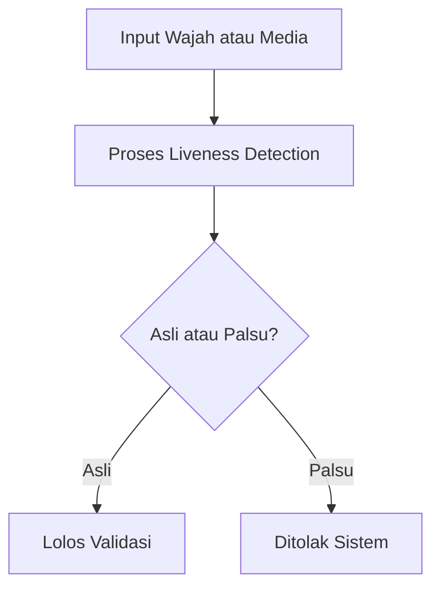

Keterangan Gambar 3.13 Diagram Pengujian Liveness Detection

#### 3.10.4 Pengujian Voting

Pengujian voting dilakukan untuk memastikan bahwa pemilih yang telah lolos autentikasi dapat memilih kandidat dengan benar, suara tersimpan ke basis data, dan status pemilih berubah menjadi sudah memilih. Pengujian ini juga memastikan bahwa sistem menolak percobaan voting ulang dari pemilih yang sama sehingga prinsip satu pemilih satu suara dapat diterapkan [3], [4].

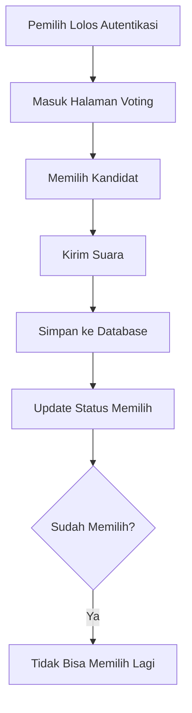

Keterangan Gambar 3.14 Diagram Pengujian Voting

### 3.11 Indikator Keberhasilan Sistem

Indikator keberhasilan sistem digunakan untuk menilai apakah sistem yang dibangun telah sesuai dengan tujuan penelitian. Indikator ini disusun berdasarkan kebutuhan sistem, rancangan proses voting, dan metode pengujian yang telah ditentukan [1], [2], [8]. Rincian indikator keberhasilan ditunjukkan pada Tabel 3.4.

| No | Indikator Keberhasilan | Parameter Keberhasilan |
|---|---|---|
| 1 | Autentikasi wajah berjalan | Sistem dapat mencocokkan wajah pemilih terdaftar menggunakan *face embedding* InsightFace. |
| 2 | Validasi keaslian wajah berjalan | Sistem dapat melakukan *liveness detection* untuk membedakan wajah asli dan media tiruan. |
| 3 | Penolakan akses tidak sah berjalan | Sistem menolak wajah yang tidak cocok, wajah yang tidak terdaftar, atau wajah yang gagal pada proses *liveness detection*. |
| 4 | Proses voting berjalan | Pemilih yang lolos autentikasi dapat memilih kandidat dan mengirim suara melalui sistem. |
| 5 | Pembatasan satu suara berjalan | Sistem menolak pemilih yang sudah pernah memberikan suara. |
| 6 | Penyimpanan dan rekapitulasi berjalan | Suara tersimpan di basis data dan hasil voting dapat ditampilkan secara otomatis. |
| 7 | Sistem mendukung efisiensi pemilihan | Proses pemilihan menjadi lebih terstruktur karena pendataan, autentikasi, voting, dan rekapitulasi dilakukan melalui sistem. |

Keterangan Tabel 3.4 Indikator Keberhasilan Sistem

## Daftar Pustaka

[1] R. S. Pressman and B. R. Maxim, *Software Engineering: A Practitioner's Approach*, 9th ed. New York, NY, USA: McGraw-Hill, 2019.

[2] I. Sommerville, *Software Engineering*, 10th ed. Boston, MA, USA: Pearson, 2016.

[3] S. Heiberg, K. Krips, J. Willemson, and P. Vinkel, "Facial Recognition for Remote Electronic Voting - Missing Piece of the Puzzle or Yet Another Liability?," in *Emerging Technologies for Authorization and Authentication*, Cham: Springer, 2022, pp. 77-93, doi: 10.1007/978-3-030-93747-8_6.

[4] M. J. H. Faruk, F. Alam, M. Islam, M. A. Rahman, Y. B. Zikria, and S. Rho, "Transforming Online Voting Through Biometrics and Identity Verification," *Cluster Computing*, vol. 27, pp. 4015-4034, 2024, doi: 10.1007/s10586-023-04261-x.

[5] H. Xing, S. Y. Tan, F. Qamar, and Y. Jiao, "Face Anti-Spoofing Based on Deep Learning: A Comprehensive Survey," *Applied Sciences*, vol. 15, no. 12, art. no. 6891, 2025, doi: 10.3390/app15126891.

[6] J. Guo and J. Deng, "InsightFace: An Open Source 2D and 3D Deep Face Analysis Library," GitHub repository, 2022. [Online]. Available: https://github.com/deepinsight/insightface. [Accessed: Apr. 8, 2026].

[7] J. Egocheaga, W. Angulo, and C. Salas, "VOTUM: Secure and Transparent E-Voting System," in *Proceedings of the Ninth International Congress on Information and Communication Technology*, Singapore: Springer, 2024, pp. 89-99, doi: 10.1007/978-981-97-4581-4_8.

[8] G. J. Myers, C. Sandler, and T. Badgett, *The Art of Software Testing*, 3rd ed. Hoboken, NJ, USA: John Wiley & Sons, 2011.
