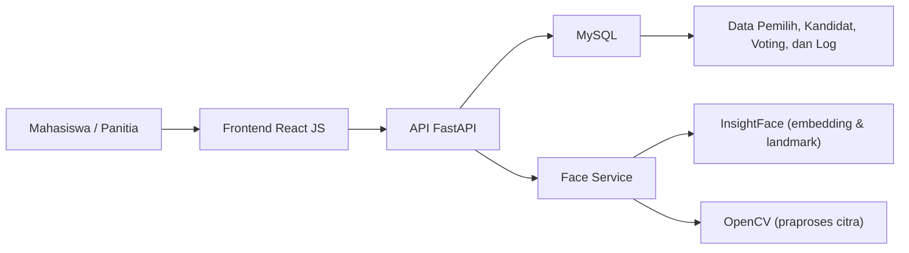
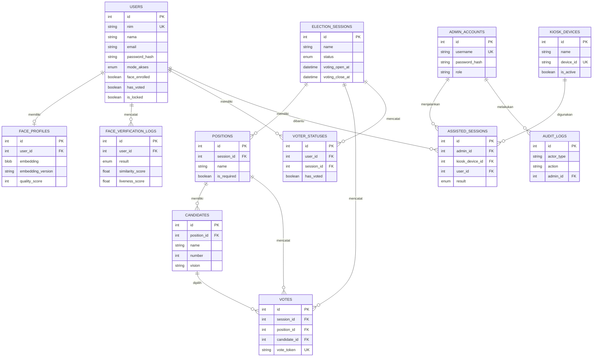
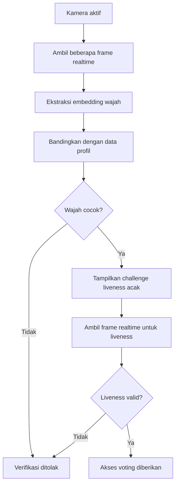
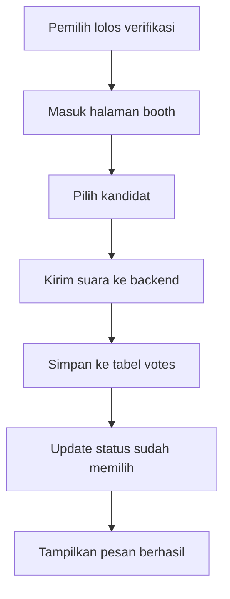

# BAB IV

## HASIL DAN PEMBAHASAN

### 4.1 Gambaran Umum Implementasi

Hasil penelitian ini berupa sistem *e-voting* berbasis web untuk pemilihan Ketua Himpunan Mahasiswa Teknik Informatika. Sistem dibangun dengan arsitektur *client-server* menggunakan *frontend* React JS dan *backend* FastAPI, dengan penyimpanan data pada basis data relasional MySQL. Sistem tidak hanya menyediakan proses login dan pemungutan suara, tetapi juga mendukung registrasi wajah, verifikasi wajah berbasis *face embedding*, serta *liveness detection* secara *realtime* untuk meningkatkan keamanan autentikasi pemilih.

Secara fungsional, sistem dibagi menjadi dua peran utama, yaitu mahasiswa sebagai pemilih dan panitia sebagai pengelola sistem. Mahasiswa dapat melakukan pendaftaran akun, registrasi wajah, login, verifikasi identitas, dan pemberian suara. Panitia dapat mengelola data mahasiswa, kandidat, sesi pemilihan, dan melihat rekapitulasi hasil voting.

Alur implementasi sistem mengikuti rancangan pada BAB III, yaitu:

1. Mahasiswa login menggunakan NIM dan password.
2. Sistem memverifikasi wajah secara *realtime* dengan beberapa *frame* kamera.
3. Jika wajah sesuai, sistem menampilkan satu tantangan *liveness* acak secara otomatis.
4. Setelah *liveness* berhasil, mahasiswa diarahkan ke halaman *booth* voting.
5. Suara disimpan ke basis data dan status pemilih diperbarui menjadi sudah memilih.

Keterangan Gambar 4.1 Arsitektur Implementasi Sistem

### 4.2 Hasil Implementasi Sistem

#### 4.2.1 Antarmuka Pengguna

Antarmuka pengguna dibangun menggunakan React JS dan Vite agar tampilan responsif dan mudah digunakan. Halaman utama yang tersedia pada sistem meliputi:

1. Halaman beranda.
2. Halaman daftar akun mahasiswa.
3. Halaman login mahasiswa.
4. Halaman reset password mahasiswa.
5. Halaman dashboard mahasiswa.
6. Halaman registrasi wajah.
7. Halaman verifikasi wajah dan *liveness*.
8. Halaman *booth* voting.
9. Halaman status sudah memilih.
10. Halaman selesai.
11. Halaman login panitia.
12. Halaman dashboard panitia.
13. Halaman kiosk mode bantuan panitia (*admin-assisted*).
14. Halaman pengelolaan kandidat.
15. Halaman pengelolaan mahasiswa.
16. Halaman rekapitulasi hasil.

Struktur halaman tersebut memisahkan fungsi mahasiswa dan panitia sehingga alur penggunaan sistem menjadi lebih jelas.

**Tangkapan layar antarmuka yang perlu disisipkan:**

- 📸 **[SS-01]** Halaman beranda (`/`) — *Gambar 4.5 Halaman Beranda*.
- 📸 **[SS-02]** Halaman login mahasiswa (`/login`) — *Gambar 4.6 Halaman Login Mahasiswa*.
- 📸 **[SS-03]** Halaman dashboard mahasiswa (`/dashboard`) — *Gambar 4.7 Halaman Dashboard Mahasiswa*.
- 📸 **[SS-04]** Halaman login panitia (`/admin/login`) — *Gambar 4.8 Halaman Login Panitia*.
- 📸 **[SS-05]** Halaman dashboard panitia beserta statistik pemilih (`/admin/dashboard`) — *Gambar 4.9 Halaman Dashboard Panitia*.
- 📸 **[SS-06]** Halaman pengelolaan kandidat (`/admin/kandidat`) — *Gambar 4.10 Halaman Pengelolaan Kandidat*.
- 📸 **[SS-07]** Halaman pengelolaan mahasiswa — kolom status wajah, status memilih, dan akun terkunci (`/admin/mahasiswa`) — *Gambar 4.11 Halaman Pengelolaan Mahasiswa*.
- 📸 **[SS-08]** Halaman rekapitulasi hasil (`/admin/rekapitulasi`) — *Gambar 4.12 Halaman Rekapitulasi Hasil*.
- 📸 **[SS-09]** Halaman kiosk mode admin-assisted saat input NIM (`/admin/kiosk`) — *Gambar 4.13 Halaman Kiosk Mode Admin-Assisted*.
- 📸 **[SS-10]** Halaman status "sudah memilih" atau halaman selesai — *Gambar 4.14 Halaman Selesai*.

#### 4.2.2 Autentikasi Pengguna

Autentikasi pengguna pada sistem terdiri atas login mahasiswa dan login panitia. Login mahasiswa menggunakan NIM dan password, sedangkan login panitia menggunakan username dan password akun admin. Setelah login berhasil, token autentikasi disimpan untuk membatasi akses berdasarkan peran pengguna.

Pada sisi mahasiswa, login menjadi tahap awal sebelum registrasi wajah dan verifikasi biometrik dilakukan. Pada sisi panitia, autentikasi digunakan untuk membuka dashboard pengelolaan data pemilih, kandidat, dan hasil voting.

#### 4.2.3 Implementasi Basis Data

Basis data dirancang menggunakan tabel-tabel utama yang merepresentasikan entitas pada sistem *e-voting*. Tabel utama yang digunakan antara lain:

| No | Tabel | Fungsi |
|---|---|---|
| 1 | `users` | Menyimpan data mahasiswa, termasuk NIM, nama, email, password hash, mode akses, dan status pemilih. |
| 2 | `face_profiles` | Menyimpan data *face embedding* hasil registrasi wajah. |
| 3 | `election_sessions` | Menyimpan data sesi pemilihan beserta jadwal dan status. |
| 4 | `positions` | Menyimpan data jabatan yang dipilih pada sesi aktif. |
| 5 | `candidates` | Menyimpan data kandidat beserta nomor urut, visi, dan foto. |
| 6 | `votes` | Menyimpan suara yang diberikan pada setiap jabatan. |
| 7 | `voter_statuses` | Menyimpan status apakah pemilih sudah memilih pada sesi aktif. |
| 8 | `face_verification_logs` | Menyimpan log hasil verifikasi wajah dan *liveness*. |
| 9 | `kiosk_devices` | Menyimpan data perangkat kiosk untuk mode bantuan panitia. |
| 10 | `assisted_sessions` | Menyimpan riwayat sesi bantuan panitia. |
| 11 | `admin_accounts` | Menyimpan data akun panitia/admin beserta peran (role). |
| 12 | `audit_logs` | Menyimpan catatan audit aksi yang dilakukan pada sistem. |

Keterangan Tabel 4.1 Implementasi Tabel Basis Data

Keterangan Gambar 4.2 Struktur Data Utama Sistem

> 📸 **[SS-11]** Struktur tabel basis data — tangkap daftar tabel pada Adminer (http://localhost:8080) atau MySQL, memperlihatkan tabel `users`, `face_profiles`, `candidates`, `votes`, `voter_statuses`, dan lainnya.

Keterangan Gambar 4.15 Struktur Tabel Basis Data

**Kamus Data**

Kamus data berikut menjelaskan struktur setiap tabel pada basis data sistem, meliputi nama field, tipe/lebar data, kunci (*key*), dan keterangan.

Tabel `users`

| No | Nama Field | Tipe/Lebar | Key | Keterangan |
|---|---|---|---|---|
| 1 | id | Integer | Primary Key | ID pengguna |
| 2 | nim | Varchar(20) | Unique | NIM mahasiswa |
| 3 | nama | Varchar(150) | | Nama lengkap mahasiswa |
| 4 | email | Varchar(150) | Unique | Email kampus |
| 5 | password_hash | Varchar(255) | | Hash password |
| 6 | kelas | Varchar(50) | | Kelas mahasiswa |
| 7 | mode_akses | Enum(mandiri, admin_assisted) | | Mode akses pemilih |
| 8 | face_enrolled | Boolean | | Status registrasi wajah |
| 9 | has_voted | Boolean | | Status sudah memilih |
| 10 | is_locked | Boolean | | Status akun terkunci |
| 11 | is_dpt_member | Boolean | | Status anggota DPT |
| 12 | face_note | Text | | Catatan verifikasi wajah |
| 13 | created_at | DateTime | | Waktu data dibuat |
| 14 | updated_at | DateTime | | Waktu data diperbarui |

Tabel `admin_accounts`

| No | Nama Field | Tipe/Lebar | Key | Keterangan |
|---|---|---|---|---|
| 1 | id | Integer | Primary Key | ID admin |
| 2 | username | Varchar(80) | Unique | Username panitia |
| 3 | password_hash | Varchar(255) | | Hash password |
| 4 | role | Varchar(50) | | Peran akun |
| 5 | created_at | DateTime | | Waktu data dibuat |
| 6 | updated_at | DateTime | | Waktu data diperbarui |

Tabel `kiosk_devices`

| No | Nama Field | Tipe/Lebar | Key | Keterangan |
|---|---|---|---|---|
| 1 | id | Integer | Primary Key | ID perangkat kiosk |
| 2 | name | Varchar(150) | | Nama perangkat |
| 3 | device_id | Varchar(100) | Unique | Identitas perangkat |
| 4 | ip_address | Varchar(45) | | Alamat IP perangkat |
| 5 | is_active | Boolean | | Status aktif |
| 6 | location | Varchar(150) | | Lokasi perangkat |
| 7 | created_at | DateTime | | Waktu data dibuat |
| 8 | updated_at | DateTime | | Waktu data diperbarui |

Tabel `election_sessions`

| No | Nama Field | Tipe/Lebar | Key | Keterangan |
|---|---|---|---|---|
| 1 | id | Integer | Primary Key | ID sesi pemilihan |
| 2 | name | Varchar(150) | | Nama sesi pemilihan |
| 3 | status | Enum(draft, registration_open, voting_open, closed) | | Status sesi |
| 4 | registration_open_at | DateTime | | Waktu buka pendaftaran |
| 5 | registration_close_at | DateTime | | Waktu tutup pendaftaran |
| 6 | voting_open_at | DateTime | | Waktu buka pemungutan suara |
| 7 | voting_close_at | DateTime | | Waktu tutup pemungutan suara |
| 8 | description | Text | | Deskripsi sesi |
| 9 | created_at | DateTime | | Waktu data dibuat |
| 10 | updated_at | DateTime | | Waktu data diperbarui |

Tabel `positions`

| No | Nama Field | Tipe/Lebar | Key | Keterangan |
|---|---|---|---|---|
| 1 | id | Integer | Primary Key | ID jabatan |
| 2 | session_id | Integer | Foreign Key | Relasi ke sesi pemilihan |
| 3 | name | Varchar(150) | | Nama jabatan |
| 4 | is_required | Boolean | | Wajib diisi atau tidak |
| 5 | created_at | DateTime | | Waktu data dibuat |
| 6 | updated_at | DateTime | | Waktu data diperbarui |

Tabel `candidates`

| No | Nama Field | Tipe/Lebar | Key | Keterangan |
|---|---|---|---|---|
| 1 | id | Integer | Primary Key | ID kandidat |
| 2 | position_id | Integer | Foreign Key | Relasi ke jabatan |
| 3 | name | Varchar(150) | | Nama kandidat |
| 4 | number | Integer | | Nomor urut kandidat |
| 5 | vision | Text | | Visi/misi kandidat |
| 6 | photo_path | Varchar(255) | | Path foto kandidat (opsional, penyimpanan berbasis file) |
| 7 | photo_base64 | Blob | | Foto kandidat tersimpan sebagai data URL base64 |
| 8 | color | Varchar(20) | | Warna identitas kandidat |
| 9 | created_at | DateTime | | Waktu data dibuat |
| 10 | updated_at | DateTime | | Waktu data diperbarui |

Tabel `votes`

| No | Nama Field | Tipe/Lebar | Key | Keterangan |
|---|---|---|---|---|
| 1 | id | Integer | Primary Key | ID suara |
| 2 | session_id | Integer | Foreign Key | Relasi ke sesi pemilihan |
| 3 | position_id | Integer | Foreign Key | Relasi ke jabatan |
| 4 | candidate_id | Integer | Foreign Key | Relasi ke kandidat |
| 5 | vote_token | Varchar(64) | Unique | Token suara anonim |
| 6 | created_at | DateTime | | Waktu data dibuat |
| 7 | updated_at | DateTime | | Waktu data diperbarui |

Tabel `voter_statuses`

| No | Nama Field | Tipe/Lebar | Key | Keterangan |
|---|---|---|---|---|
| 1 | id | Integer | Primary Key | ID status pemilih |
| 2 | user_id | Integer | Foreign Key | Relasi ke mahasiswa |
| 3 | session_id | Integer | Foreign Key | Relasi ke sesi pemilihan |
| 4 | has_voted | Boolean | | Status sudah memilih |
| 5 | voted_at | DateTime | | Waktu memberikan suara |
| 6 | created_at | DateTime | | Waktu data dibuat |
| 7 | updated_at | DateTime | | Waktu data diperbarui |

Tabel `face_profiles`

| No | Nama Field | Tipe/Lebar | Key | Keterangan |
|---|---|---|---|---|
| 1 | id | Integer | Primary Key | ID profil wajah |
| 2 | user_id | Integer | Foreign Key, Unique | Relasi ke mahasiswa |
| 3 | embedding | Blob | | Data *face embedding* (5 pose) |
| 4 | embedding_version | Varchar(50) | | Versi/skema embedding |
| 5 | image_path | Varchar(255) | | Path citra (opsional) |
| 6 | quality_score | Integer | | Skor kualitas citra |
| 7 | notes | Text | | Catatan |
| 8 | created_at | DateTime | | Waktu data dibuat |
| 9 | updated_at | DateTime | | Waktu data diperbarui |

Tabel `face_verification_logs`

| No | Nama Field | Tipe/Lebar | Key | Keterangan |
|---|---|---|---|---|
| 1 | id | Integer | Primary Key | ID log verifikasi |
| 2 | user_id | Integer | Foreign Key | Relasi ke mahasiswa |
| 3 | result | Enum(valid, invalid, locked) | | Hasil verifikasi |
| 4 | similarity_score | Float | | Nilai kemiripan wajah |
| 5 | liveness_score | Float | | Nilai liveness |
| 6 | reason | Varchar(255) | | Alasan/keterangan hasil |
| 7 | device_info | Text | | Informasi perangkat |
| 8 | created_at | DateTime | | Waktu data dibuat |
| 9 | updated_at | DateTime | | Waktu data diperbarui |

Tabel `assisted_sessions`

| No | Nama Field | Tipe/Lebar | Key | Keterangan |
|---|---|---|---|---|
| 1 | id | Integer | Primary Key | ID sesi bantuan |
| 2 | admin_id | Integer | Foreign Key | Relasi ke admin/panitia |
| 3 | kiosk_device_id | Integer | Foreign Key | Relasi ke perangkat kiosk |
| 4 | user_id | Integer | Foreign Key | Relasi ke mahasiswa yang dibantu |
| 5 | started_at | DateTime | | Waktu mulai sesi |
| 6 | ended_at | DateTime | | Waktu selesai sesi |
| 7 | result | Enum(success, failed, cancelled) | | Hasil sesi bantuan |
| 8 | notes | Text | | Catatan |
| 9 | created_at | DateTime | | Waktu data dibuat |
| 10 | updated_at | DateTime | | Waktu data diperbarui |

Tabel `audit_logs`

| No | Nama Field | Tipe/Lebar | Key | Keterangan |
|---|---|---|---|---|
| 1 | id | Integer | Primary Key | ID log audit |
| 2 | actor_type | Varchar(30) | | Jenis pelaku aksi |
| 3 | actor_id | Integer | | ID pelaku aksi |
| 4 | action | Varchar(100) | | Aksi yang dilakukan |
| 5 | target | Varchar(150) | | Objek yang dikenai aksi |
| 6 | details | Text | | Rincian aksi |
| 7 | admin_id | Integer | Foreign Key | Relasi ke admin (jika ada) |
| 8 | created_at | DateTime | | Waktu data dibuat |
| 9 | updated_at | DateTime | | Waktu data diperbarui |

Keterangan Tabel 4.2 Kamus Data Basis Data Sistem

#### 4.2.4 Registrasi Wajah

Registrasi wajah dilakukan setelah pengguna berhasil membuat akun dan masuk ke dashboard mahasiswa. Berbeda dengan registrasi satu gambar, sistem memindai wajah pengguna dari lima sudut secara terpandu, yaitu menghadap ke tengah (lurus), atas, kanan, bawah, dan kiri. Untuk setiap pose, antarmuka memberikan instruksi arah dan hitung mundur singkat sebelum *frame* diambil, sehingga pengguna dapat memposisikan wajah dengan benar.

Setiap *frame* pose diproses oleh backend untuk mendeteksi wajah, mengukur kualitas citra (pencahayaan dan ketajaman), lalu mengekstraksi *face embedding* menggunakan InsightFace (model ArcFace *buffalo_l*). Sistem memvalidasi bahwa hanya terdapat satu wajah pada setiap *frame*; jika tidak, pose tersebut ditolak dan pengguna diminta mengulang.

Kelima embedding pose disimpan bersama pada tabel `face_profiles` dalam satu kolom biner (format array), bukan citra mentah sebagai data utama. Penyimpanan banyak sudut ini membuat proses verifikasi lebih tahan terhadap variasi posisi kepala dan pencahayaan, karena pencocokan pada tahap verifikasi dapat dibandingkan terhadap sudut yang paling mendekati.

> 📸 **[SS-12]** Halaman registrasi wajah — tangkap proses pemindaian 5 pose (`/registrasi-wajah`), tampak indikator lima pose (tengah, atas, kanan, bawah, kiri) dan panduan arah.

Keterangan Gambar 4.16 Proses Pemindaian Wajah (Registrasi 5 Pose)

#### 4.2.5 Verifikasi Wajah Secara Realtime

Verifikasi wajah dilakukan secara *realtime* dengan mengalirkan (*streaming*) *frame* kamera ke backend secara berkala, bukan melalui satu gambar statis. Pendekatan ini bertujuan memperoleh sampel wajah yang lebih representatif sehingga pencocokan identitas menjadi lebih stabil.

Alur verifikasi dimulai ketika kamera aktif dan sistem secara berkala menangkap *frame* dari webcam, lalu mengirimkannya ke backend untuk dianalisis. Backend mengekstraksi embedding dari tiap *frame* dan menghitung tingkat kemiripan (*cosine similarity*) terhadap seluruh embedding pose yang tersimpan pada profil pengguna, kemudian mengambil nilai kemiripan tertinggi. Jika nilai tersebut melebihi ambang batas yang ditentukan, maka pengguna dinyatakan cocok dan proses berlanjut secara otomatis ke tahap *liveness detection*. Sistem tidak membatasi jumlah percobaan — selama wajah maupun tantangan *liveness* belum sesuai, mahasiswa dapat terus mengulang proses pemindaian hingga berhasil, tanpa risiko akun terkunci.

Keterangan Gambar 4.3 Alur Verifikasi Wajah dan Liveness

> 📸 **[SS-13]** Verifikasi wajah realtime — tangkap layar `/verifikasi-wajah` saat pemindaian berjalan, tampak indikator kecocokan (bar *similarity*) dan status "Memindai & mencocokkan…".

Keterangan Gambar 4.17 Proses Verifikasi Wajah Realtime

#### 4.2.6 Liveness Detection

Setelah wajah berhasil terverifikasi, sistem menampilkan satu tantangan *liveness* acak secara otomatis. Tantangan yang tersedia meliputi dua gerakan, yaitu menghadap ke kiri dan menghadap ke kanan. Tantangan dipilih secara acak oleh sistem agar proses verifikasi tidak mudah diprediksi maupun dipalsukan.

Penilaian *liveness* dilakukan di sisi backend dengan menganalisis sinyal dari hasil deteksi InsightFace pada *frame* yang dialirkan. Gerakan menghadap ke kiri atau kanan dinilai dari sudut kepala (*yaw*) hasil estimasi pose wajah, dibandingkan terhadap ambang batas derajat kemiringan tertentu. Sistem menyatakan *liveness* valid ketika *frame* yang masuk memenuhi kriteria tantangan yang diminta dalam batas waktu tertentu. Dengan mewajibkan gerakan aktif yang dipilih secara acak, sistem dapat membedakan wajah asli yang hadir langsung di depan kamera dari media tiruan seperti foto atau video yang bersifat statis.

> 📸 **[SS-14]** Tantangan liveness — tangkap saat banner tantangan acak muncul (mis. "Tolehkan kepala ke KIRI" atau "Tolehkan kepala ke KANAN").

Keterangan Gambar 4.18 Proses Liveness Detection

#### 4.2.7 Proses Voting

Setelah proses autentikasi wajah dan *liveness detection* berhasil, pemilih diarahkan ke halaman *booth* voting. Pada halaman ini, pengguna dapat melihat daftar kandidat sesuai jabatan yang dibuka dalam sesi pemilihan aktif. Setelah memilih kandidat, suara dikirim ke backend dan disimpan pada tabel `votes`.

Sistem juga memperbarui status pemilih pada tabel `voter_statuses` dan atribut `has_voted` pada tabel pengguna agar pemilih tidak dapat memberikan suara lebih dari satu kali. Mekanisme ini penting untuk menjaga integritas hasil pemilihan.

Keterangan Gambar 4.4 Alur Proses Voting

> 📸 **[SS-15]** Halaman booth voting — tangkap daftar kandidat per jabatan beserta tombol pilih (`/booth`).

Keterangan Gambar 4.19 Proses Pemungutan Suara (Voting)

#### 4.2.8 Dashboard Panitia

Dashboard panitia digunakan untuk mengelola data yang terkait dengan pemilihan. Fitur yang tersedia meliputi pengelolaan data mahasiswa, pengelolaan kandidat, pengelolaan sesi pemilihan, pemantauan suara yang masuk, dan rekapitulasi hasil voting.

Pada halaman pengelolaan mahasiswa, panitia dapat melihat daftar pemilih, status registrasi wajah, status memilih, serta kondisi akun yang terkunci. Pada halaman pengelolaan kandidat, panitia dapat menambah, mengubah, dan menghapus data kandidat sesuai jabatan. Sementara itu, pada halaman rekapitulasi, panitia dapat melihat total suara per kandidat dan hasil akhir pemilihan.

> 📸 Tangkapan layar untuk bagian ini memakai SS-05 (dashboard panitia), SS-06 (pengelolaan kandidat), SS-07 (pengelolaan mahasiswa), dan SS-08 (rekapitulasi hasil).

### 4.3 Hasil Pengujian Sistem

#### 4.3.1 Validasi Implementasi

Sebelum pengujian fungsional dilakukan, implementasi diverifikasi terlebih dahulu melalui kompilasi kode, *build* frontend, dan validasi langsung terhadap *pipeline* biometrik menggunakan model InsightFace *buffalo_l*. Hasil verifikasi menunjukkan bahwa:

1. Backend berhasil melalui pengecekan sintaks menggunakan `py_compile`.
2. Frontend berhasil dibangun menggunakan `vite build`.
3. *Pipeline* biometrik berjalan sesuai rancangan, yaitu wajah berhasil dideteksi, kelima pose registrasi diterima, pencocokan wajah yang sama menghasilkan nilai kemiripan mendekati sempurna, dan tantangan *liveness* menolak wajah netral yang tidak melakukan gerakan.

| No | Pengujian | Hasil |
|---|---|---|
| 1 | Kompilasi backend (`py_compile`) | Berhasil |
| 2 | *Build* frontend (`vite build`) | Berhasil |
| 3 | Deteksi wajah & ekstraksi embedding | Berhasil (1 wajah terdeteksi, embedding terbentuk) |
| 4 | Registrasi lima pose | Berhasil (5 dari 5 pose diterima) |
| 5 | Pencocokan wajah yang sama | Nilai kemiripan 1,00 (di atas ambang 0,35) |
| 6 | Tantangan *liveness* pada wajah netral | Sesuai (tidak lolos tanpa gerakan aktif) |

Keterangan Tabel 4.3 Hasil Validasi Implementasi

**Tangkapan layar hasil validasi yang perlu disertakan:**

- 📸 **[SS-16]** Hasil `pytest -v` — seluruh 40 test PASSED (jalankan `pytest -v` pada folder `backend`) — *Gambar 4.20 Hasil Pengujian Otomatis Seluruh Modul*.
- 📸 **[SS-17]** Hasil `vite build` berhasil (jalankan `npm run build` pada folder `mockup`) — *Gambar 4.21 Hasil Build Frontend*.
- 📸 **[SS-18]** Hasil validasi model InsightFace — nilai kemiripan 1,00 dan 5 dari 5 pose diterima — *Gambar 4.22 Hasil Validasi Model InsightFace*.

#### 4.3.2 Pengujian Fungsional

Pengujian fungsional dilakukan untuk mengetahui apakah setiap fitur sistem berjalan sesuai kebutuhan. Pengujian dilakukan berdasarkan input dan output yang dihasilkan oleh sistem.

| No | Skenario Pengujian | Input | Output yang Diharapkan | Hasil |
|---|---|---|---|---|
| 1 | Registrasi akun mahasiswa | NIM, nama, email, password | Akun mahasiswa tersimpan dan dapat login | Sesuai |
| 2 | Login mahasiswa valid | NIM dan password benar | Pengguna masuk ke dashboard mahasiswa | Sesuai |
| 3 | Login mahasiswa tidak valid | NIM atau password salah | Sistem menolak login | Sesuai |
| 4 | Registrasi wajah | Citra wajah dari kamera | *Face embedding* tersimpan pada profil wajah | Sesuai |
| 5 | Verifikasi wajah realtime | Beberapa *frame* webcam | Wajah dicocokkan dengan profil pengguna | Sesuai |
| 6 | *Liveness* acak | Gerakan wajah sesuai instruksi | Sistem memberikan status valid | Sesuai |
| 7 | Verifikasi gagal | Wajah tidak cocok atau tidak terdeteksi | Sistem menolak akses ke voting | Sesuai |
| 8 | Voting setelah verifikasi berhasil | Pemilihan kandidat | Suara tersimpan dan status berubah menjadi sudah memilih | Sesuai |
| 9 | Voting ulang oleh pemilih yang sama | Akses ulang ke booth | Sistem menolak pemungutan suara ganda | Sesuai |
| 10 | Pengelolaan kandidat oleh panitia | Tambah/ubah/hapus kandidat | Data kandidat diperbarui | Sesuai |
| 11 | Rekapitulasi hasil | Akses halaman rekapitulasi | Total suara tampil sesuai data tersimpan | Sesuai |

Keterangan Tabel 4.4 Hasil Pengujian Fungsional Sistem

Setiap baris pengujian pada tabel di atas dibuktikan dengan *unit* dan *integration test* otomatis (pytest). Tangkapan layar hasil pengujian per modul yang perlu disertakan (jalankan tiap perintah pada folder `backend`, lalu tangkap keluarannya):

- 📸 **[SS-19]** Modul Autentikasi — `pytest tests/test_modul_autentikasi.py -v` — *Gambar 4.23 Hasil Pengujian Modul Autentikasi*.
- 📸 **[SS-20]** Modul Registrasi Wajah — `pytest tests/test_modul_registrasi_wajah.py -v` — *Gambar 4.24 Hasil Pengujian Modul Registrasi Wajah*.
- 📸 **[SS-21]** Modul Verifikasi & Liveness — `pytest tests/test_modul_verifikasi_liveness.py -v` — *Gambar 4.25 Hasil Pengujian Modul Verifikasi & Liveness*.
- 📸 **[SS-22]** Modul Pemungutan Suara — `pytest tests/test_modul_voting.py -v` — *Gambar 4.26 Hasil Pengujian Modul Pemungutan Suara*.
- 📸 **[SS-23]** Modul Panitia/Admin — `pytest tests/test_modul_admin.py -v` — *Gambar 4.27 Hasil Pengujian Modul Panitia/Admin*.
- 📸 **[SS-24]** Modul Keamanan — `pytest tests/test_modul_keamanan.py -v` — *Gambar 4.28 Hasil Pengujian Modul Keamanan*.
- 📸 **[SS-25]** Modul Face Service (unit algoritma) — `pytest tests/test_face_service.py -v` — *Gambar 4.29 Hasil Pengujian Modul Face Service*.

#### 4.3.3 Pengujian Alur Realtime

Pengujian alur realtime dilakukan untuk memastikan bahwa sistem mampu menjalankan proses identifikasi wajah secara bertahap, yaitu verifikasi wajah terlebih dahulu lalu *liveness detection* satu kali secara otomatis. Hasil pengujian menunjukkan bahwa:

1. Kamera dapat aktif dan menampilkan pratinjau kepada pengguna.
2. Sistem mampu mengambil beberapa *frame* wajah secara berurutan.
3. Sistem dapat mengirim *frame* tersebut ke backend untuk dianalisis.
4. Setelah wajah cocok, sistem langsung memunculkan tantangan *liveness* acak.
5. Jika tantangan berhasil dijalankan, sistem memberikan akses ke halaman voting.

| No | Tahap Pengujian | Kondisi | Hasil |
|---|---|---|---|
| 1 | Pengambilan *frame* realtime | Kamera aktif | Berhasil |
| 2 | Pencocokan wajah | Wajah terdaftar dan jelas | Berhasil |
| 3 | Tantangan *liveness* acak | Challenge muncul otomatis | Berhasil |
| 4 | Validasi *liveness* | Pengguna mengikuti instruksi | Berhasil |
| 5 | Akses ke halaman voting | Semua validasi lolos | Berhasil |

Keterangan Tabel 4.5 Hasil Pengujian Alur Realtime

> 📸 **[SS-26]** Alur realtime di browser — tangkap urutan singkat: pemindaian wajah → wajah cocok → tantangan liveness muncul → akses voting diberikan (dapat berupa 2–3 tangkapan berurutan).

Keterangan Gambar 4.30 Alur Verifikasi Realtime pada Peramban

#### 4.3.4 Pembatasan Satu Pemilih Satu Suara

Pengujian ini dilakukan untuk memastikan bahwa sistem tidak mengizinkan seorang pemilih memberikan suara lebih dari satu kali. Setelah suara berhasil disimpan, status pemilih diperbarui sehingga akses ulang ke halaman voting akan ditolak. Hasil pengujian menunjukkan bahwa mekanisme pembatasan suara bekerja sesuai rancangan.

### 4.4 Pembahasan

Berdasarkan hasil implementasi dan pengujian, sistem *e-voting* yang dibangun telah memenuhi tujuan penelitian, yaitu menyediakan mekanisme pemilihan yang lebih aman, efisien, dan terstruktur. Integrasi antara pengenalan wajah berbasis InsightFace dan *liveness detection* membantu meningkatkan keamanan autentikasi pemilih karena sistem tidak hanya mengenali identitas, tetapi juga memeriksa keaslian wajah yang digunakan.

Penggunaan verifikasi wajah secara *realtime* memberikan beberapa keuntungan. Pertama, proses verifikasi menjadi lebih natural karena sistem menangkap aliran *frame* kamera, bukan hanya satu gambar statis. Kedua, karena data wajah pada tahap registrasi disimpan dari lima sudut (tengah, atas, bawah, kiri, dan kanan) dan pencocokan mengambil kemiripan tertinggi di antara sudut-sudut tersebut, proses menjadi lebih toleran terhadap perubahan pencahayaan maupun posisi kepala di antara *frame*. Ketiga, proses ini mendukung pengalaman pengguna yang lebih baik karena verifikasi dilakukan langsung melalui kamera tanpa langkah manual yang berlebihan.

Selain itu, penerapan tantangan *liveness* acak satu kali membuat sistem lebih tahan terhadap serangan *spoofing*. Tantangan acak berupa menghadap ke arah tertentu (kiri atau kanan) membuat proses pemalsuan menjadi lebih sulit dilakukan. Hal ini relevan dengan tujuan penelitian yang menekankan pentingnya keamanan autentikasi pada sistem pemungutan suara digital.

Jika dilihat dari sisi pengelolaan data, sistem juga mampu memisahkan data identitas pemilih, data wajah, data kandidat, dan data suara. Pemisahan ini penting agar sistem tetap terstruktur dan mudah dipelihara. Data suara tersimpan terpisah dari data wajah sehingga proses voting tetap dapat diaudit tanpa mengganggu kerahasiaan pilihan pemilih.

### 4.5 Keterbatasan Implementasi

Walaupun sistem telah berhasil diimplementasikan, terdapat beberapa keterbatasan yang perlu diperhatikan, yaitu:

1. Kualitas hasil verifikasi masih bergantung pada kondisi kamera, pencahayaan, dan kestabilan posisi wajah.
2. Proses *realtime* membutuhkan perangkat kamera yang memadai agar hasil tangkapan *frame* konsisten.
3. Sistem masih difokuskan pada skala organisasi kampus dan belum dirancang untuk beban pemilih yang sangat besar.
4. Tantangan *liveness* bersifat *challenge-response* sederhana sehingga masih dapat dikembangkan lagi dengan model *anti-spoofing* yang lebih canggih.
5. Tantangan *liveness* saat ini dibatasi pada dua gerakan arah kepala (menoleh kiri/kanan) karena dinilai paling andal; gerakan lain seperti senyum atau kedip mata sempat diuji coba namun dihilangkan karena deteksinya kurang stabil pada kondisi kamera dan pencahayaan yang bervariasi.

### 4.6 Ringkasan Hasil

Hasil implementasi menunjukkan bahwa sistem *e-voting* berbasis pengenalan wajah menggunakan InsightFace dan *liveness detection* berhasil dibangun dan dijalankan sesuai kebutuhan penelitian. Sistem menyediakan registrasi wajah, verifikasi wajah *realtime*, tantangan *liveness* acak, proses voting, serta rekapitulasi hasil pada sisi panitia. Dengan demikian, sistem ini dapat menjadi solusi yang lebih aman dan efisien untuk pelaksanaan pemilihan Ketua Himpunan Mahasiswa Teknik Informatika.
