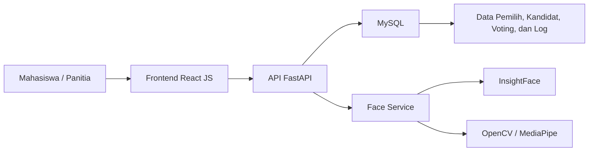
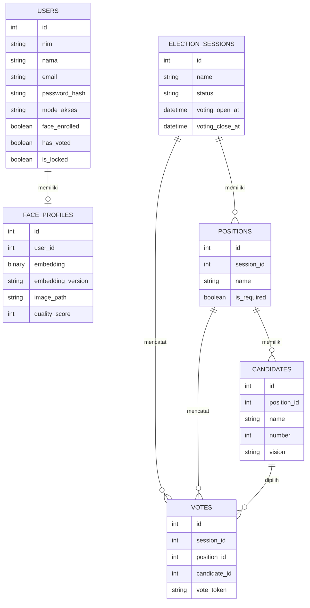
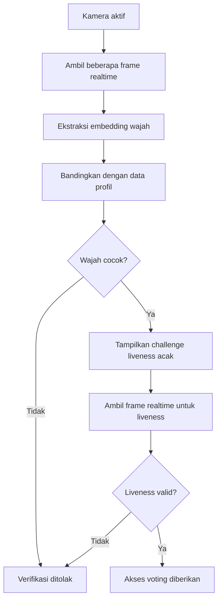
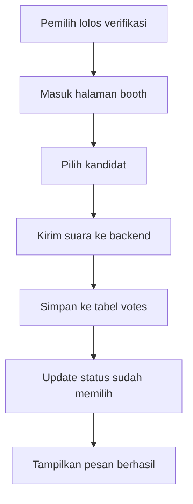

# BAB IV

## HASIL DAN PEMBAHASAN

### 4.1 Gambaran Umum Implementasi

Hasil penelitian ini berupa sistem *e-voting* berbasis web untuk pemilihan Ketua Himpunan Mahasiswa Teknik Informatika. Sistem dibangun dengan arsitektur *client-server* menggunakan *frontend* React JS dan *backend* FastAPI, dengan penyimpanan data pada basis data relasional MySQL. Sistem tidak hanya menyediakan proses login dan pemungutan suara, tetapi juga mendukung registrasi wajah, verifikasi wajah berbasis *face embedding*, serta *liveness detection* secara *realtime* untuk meningkatkan keamanan autentikasi pemilih.

Secara fungsional, sistem dibagi menjadi dua peran utama, yaitu mahasiswa sebagai pemilih dan panitia sebagai pengelola sistem. Mahasiswa dapat melakukan pendaftaran akun, registrasi wajah, login, verifikasi identitas, dan pemberian suara. Panitia dapat mengelola data mahasiswa, kandidat, sesi pemilihan, dan melihat rekapitulasi hasil voting.

Alur implementasi sistem mengikuti rancangan pada BAB III, yaitu:

1. Mahasiswa login menggunakan NIM dan password.
2. Sistem memverifikasi wajah secara *realtime* dengan beberapa *frame* kamera.
3. Jika wajah sesuai, sistem menampilkan satu tantangan *liveness* acak secara otomatis.
4. Setelah *liveness* berhasil, mahasiswa diarahkan ke halaman *booth* voting.
5. Suara disimpan ke basis data dan status pemilih diperbarui menjadi sudah memilih.

Keterangan Gambar 4.1 Arsitektur Implementasi Sistem

### 4.2 Hasil Implementasi Sistem

#### 4.2.1 Antarmuka Pengguna

Antarmuka pengguna dibangun menggunakan React JS dan Vite agar tampilan responsif dan mudah digunakan. Halaman utama yang tersedia pada sistem meliputi:

1. Halaman beranda.
2. Halaman daftar akun mahasiswa.
3. Halaman login mahasiswa.
4. Halaman dashboard mahasiswa.
5. Halaman registrasi wajah.
6. Halaman verifikasi wajah dan *liveness*.
7. Halaman *booth* voting.
8. Halaman status sudah memilih.
9. Halaman selesai.
10. Halaman login panitia.
11. Halaman dashboard panitia.
12. Halaman pengelolaan kandidat.
13. Halaman pengelolaan mahasiswa.
14. Halaman rekapitulasi hasil.

Struktur halaman tersebut memisahkan fungsi mahasiswa dan panitia sehingga alur penggunaan sistem menjadi lebih jelas.

#### 4.2.2 Autentikasi Pengguna

Autentikasi pengguna pada sistem terdiri atas login mahasiswa dan login panitia. Login mahasiswa menggunakan NIM dan password, sedangkan login panitia menggunakan username dan password akun admin. Setelah login berhasil, token autentikasi disimpan untuk membatasi akses berdasarkan peran pengguna.

Pada sisi mahasiswa, login menjadi tahap awal sebelum registrasi wajah dan verifikasi biometrik dilakukan. Pada sisi panitia, autentikasi digunakan untuk membuka dashboard pengelolaan data pemilih, kandidat, dan hasil voting.

#### 4.2.3 Implementasi Basis Data

Basis data dirancang menggunakan tabel-tabel utama yang merepresentasikan entitas pada sistem *e-voting*. Tabel utama yang digunakan antara lain:

| No | Tabel | Fungsi |
|---|---|---|
| 1 | `users` | Menyimpan data mahasiswa, termasuk NIM, nama, email, password hash, mode akses, dan status pemilih. |
| 2 | `face_profiles` | Menyimpan data *face embedding* hasil registrasi wajah. |
| 3 | `election_sessions` | Menyimpan data sesi pemilihan beserta jadwal dan status. |
| 4 | `positions` | Menyimpan data jabatan yang dipilih pada sesi aktif. |
| 5 | `candidates` | Menyimpan data kandidat beserta nomor urut, visi, dan foto. |
| 6 | `votes` | Menyimpan suara yang diberikan pada setiap jabatan. |
| 7 | `voter_statuses` | Menyimpan status apakah pemilih sudah memilih pada sesi aktif. |
| 8 | `face_verification_logs` | Menyimpan log hasil verifikasi wajah dan *liveness*. |
| 9 | `kiosk_devices` | Menyimpan data perangkat kiosk untuk mode bantuan panitia. |
| 10 | `assisted_sessions` | Menyimpan riwayat sesi bantuan panitia. |

Keterangan Tabel 4.1 Implementasi Tabel Basis Data

Keterangan Gambar 4.2 Struktur Data Utama Sistem

#### 4.2.4 Registrasi Wajah

Registrasi wajah dilakukan setelah pengguna berhasil membuat akun dan masuk ke dashboard mahasiswa. Kamera perangkat digunakan untuk menangkap citra wajah, kemudian sistem memproses gambar tersebut untuk mendeteksi wajah, mengukur kualitas citra, dan mengekstraksi *face embedding* menggunakan InsightFace.

Hasil registrasi wajah disimpan ke tabel `face_profiles` dalam bentuk vektor embedding, bukan citra mentah sebagai data utama. Pendekatan ini memudahkan proses pencocokan identitas pada tahap verifikasi dan membuat penyimpanan data biometrik lebih terstruktur.

#### 4.2.5 Verifikasi Wajah Secara Realtime

Verifikasi wajah dilakukan secara *realtime* dengan mengambil beberapa *frame* kamera secara berurutan. Berbeda dengan pendekatan satu gambar statis, proses ini bertujuan memperoleh sampel wajah yang lebih representatif sehingga pencocokan identitas menjadi lebih stabil.

Alur verifikasi dimulai ketika kamera aktif dan sistem mengambil burst *frame* dari webcam. Beberapa *frame* tersebut kemudian dikirim ke backend untuk dianalisis. Backend mengekstraksi embedding dari tiap *frame* dan menghitung kecocokan terhadap data wajah yang tersimpan pada profil pengguna. Jika nilai kemiripan melebihi ambang batas yang ditentukan, maka pengguna dinyatakan cocok dan dapat melanjutkan ke tahap *liveness detection*.

Keterangan Gambar 4.3 Alur Verifikasi Wajah dan Liveness

#### 4.2.6 Liveness Detection

Setelah wajah berhasil terverifikasi, sistem menampilkan satu tantangan *liveness* acak secara otomatis. Tantangan yang digunakan meliputi kedip mata, senyum, menghadap ke kiri, menghadap ke kanan, atau menghadap lurus ke depan. Tantangan dipilih secara acak agar proses verifikasi tidak mudah diprediksi.

Pada implementasinya, *liveness detection* dijalankan dengan mengambil beberapa *frame* webcam dalam waktu singkat. Sistem kemudian menganalisis perubahan antar *frame* untuk menilai apakah wajah menunjukkan respons alami terhadap tantangan yang diberikan. Dengan pendekatan ini, sistem dapat membedakan wajah asli yang hadir langsung di depan kamera dari media tiruan seperti foto atau video.

#### 4.2.7 Proses Voting

Setelah proses autentikasi wajah dan *liveness detection* berhasil, pemilih diarahkan ke halaman *booth* voting. Pada halaman ini, pengguna dapat melihat daftar kandidat sesuai jabatan yang dibuka dalam sesi pemilihan aktif. Setelah memilih kandidat, suara dikirim ke backend dan disimpan pada tabel `votes`.

Sistem juga memperbarui status pemilih pada tabel `voter_statuses` dan atribut `has_voted` pada tabel pengguna agar pemilih tidak dapat memberikan suara lebih dari satu kali. Mekanisme ini penting untuk menjaga integritas hasil pemilihan.

Keterangan Gambar 4.4 Alur Proses Voting

#### 4.2.8 Dashboard Panitia

Dashboard panitia digunakan untuk mengelola data yang terkait dengan pemilihan. Fitur yang tersedia meliputi pengelolaan data mahasiswa, pengelolaan kandidat, pengelolaan sesi pemilihan, pemantauan suara yang masuk, dan rekapitulasi hasil voting.

Pada halaman pengelolaan mahasiswa, panitia dapat melihat daftar pemilih, status registrasi wajah, status memilih, serta kondisi akun yang terkunci. Pada halaman pengelolaan kandidat, panitia dapat menambah, mengubah, dan menghapus data kandidat sesuai jabatan. Sementara itu, pada halaman rekapitulasi, panitia dapat melihat total suara per kandidat dan hasil akhir pemilihan.

### 4.3 Hasil Pengujian Sistem

#### 4.3.1 Validasi Implementasi

Sebelum pengujian fungsional dilakukan, implementasi backend dan frontend diverifikasi terlebih dahulu melalui proses kompilasi dan *build*. Hasil verifikasi menunjukkan bahwa:

1. Backend berhasil melalui pengecekan sintaks menggunakan `py_compile`.
2. Frontend berhasil dibangun menggunakan `vite build`.

| No | Pengujian | Hasil |
|---|---|---|
| 1 | Kompilasi backend | Berhasil |
| 2 | *Build* frontend | Berhasil |

Keterangan Tabel 4.2 Hasil Validasi Implementasi

#### 4.3.2 Pengujian Fungsional

Pengujian fungsional dilakukan untuk mengetahui apakah setiap fitur sistem berjalan sesuai kebutuhan. Pengujian dilakukan berdasarkan input dan output yang dihasilkan oleh sistem.

| No | Skenario Pengujian | Input | Output yang Diharapkan | Hasil |
|---|---|---|---|---|
| 1 | Registrasi akun mahasiswa | NIM, nama, email, password | Akun mahasiswa tersimpan dan dapat login | Sesuai |
| 2 | Login mahasiswa valid | NIM dan password benar | Pengguna masuk ke dashboard mahasiswa | Sesuai |
| 3 | Login mahasiswa tidak valid | NIM atau password salah | Sistem menolak login | Sesuai |
| 4 | Registrasi wajah | Citra wajah dari kamera | *Face embedding* tersimpan pada profil wajah | Sesuai |
| 5 | Verifikasi wajah realtime | Beberapa *frame* webcam | Wajah dicocokkan dengan profil pengguna | Sesuai |
| 6 | *Liveness* acak | Gerakan wajah sesuai instruksi | Sistem memberikan status valid | Sesuai |
| 7 | Verifikasi gagal | Wajah tidak cocok atau tidak terdeteksi | Sistem menolak akses ke voting | Sesuai |
| 8 | Voting setelah verifikasi berhasil | Pemilihan kandidat | Suara tersimpan dan status berubah menjadi sudah memilih | Sesuai |
| 9 | Voting ulang oleh pemilih yang sama | Akses ulang ke booth | Sistem menolak pemungutan suara ganda | Sesuai |
| 10 | Pengelolaan kandidat oleh panitia | Tambah/ubah/hapus kandidat | Data kandidat diperbarui | Sesuai |
| 11 | Rekapitulasi hasil | Akses halaman rekapitulasi | Total suara tampil sesuai data tersimpan | Sesuai |

Keterangan Tabel 4.3 Hasil Pengujian Fungsional Sistem

#### 4.3.3 Pengujian Alur Realtime

Pengujian alur realtime dilakukan untuk memastikan bahwa sistem mampu menjalankan proses identifikasi wajah secara bertahap, yaitu verifikasi wajah terlebih dahulu lalu *liveness detection* satu kali secara otomatis. Hasil pengujian menunjukkan bahwa:

1. Kamera dapat aktif dan menampilkan pratinjau kepada pengguna.
2. Sistem mampu mengambil beberapa *frame* wajah secara berurutan.
3. Sistem dapat mengirim *frame* tersebut ke backend untuk dianalisis.
4. Setelah wajah cocok, sistem langsung memunculkan tantangan *liveness* acak.
5. Jika tantangan berhasil dijalankan, sistem memberikan akses ke halaman voting.

| No | Tahap Pengujian | Kondisi | Hasil |
|---|---|---|---|
| 1 | Pengambilan *frame* realtime | Kamera aktif | Berhasil |
| 2 | Pencocokan wajah | Wajah terdaftar dan jelas | Berhasil |
| 3 | Tantangan *liveness* acak | Challenge muncul otomatis | Berhasil |
| 4 | Validasi *liveness* | Pengguna mengikuti instruksi | Berhasil |
| 5 | Akses ke halaman voting | Semua validasi lolos | Berhasil |

Keterangan Tabel 4.4 Hasil Pengujian Alur Realtime

#### 4.3.4 Pembatasan Satu Pemilih Satu Suara

Pengujian ini dilakukan untuk memastikan bahwa sistem tidak mengizinkan seorang pemilih memberikan suara lebih dari satu kali. Setelah suara berhasil disimpan, status pemilih diperbarui sehingga akses ulang ke halaman voting akan ditolak. Hasil pengujian menunjukkan bahwa mekanisme pembatasan suara bekerja sesuai rancangan.

### 4.4 Pembahasan

Berdasarkan hasil implementasi dan pengujian, sistem *e-voting* yang dibangun telah memenuhi tujuan penelitian, yaitu menyediakan mekanisme pemilihan yang lebih aman, efisien, dan terstruktur. Integrasi antara pengenalan wajah berbasis InsightFace dan *liveness detection* membantu meningkatkan keamanan autentikasi pemilih karena sistem tidak hanya mengenali identitas, tetapi juga memeriksa keaslian wajah yang digunakan.

Penggunaan verifikasi wajah secara *realtime* memberikan beberapa keuntungan. Pertama, proses verifikasi menjadi lebih natural karena sistem menangkap beberapa *frame* kamera, bukan hanya satu gambar statis. Kedua, pendekatan ini membantu meningkatkan ketepatan pencocokan wajah ketika pencahayaan atau posisi wajah berubah sedikit di antara *frame*. Ketiga, proses ini mendukung pengalaman pengguna yang lebih baik karena verifikasi dilakukan langsung melalui kamera tanpa langkah manual yang berlebihan.

Selain itu, penerapan tantangan *liveness* acak satu kali membuat sistem lebih tahan terhadap serangan *spoofing*. Tantangan acak seperti kedip, senyum, atau menghadap ke arah tertentu membuat proses pemalsuan menjadi lebih sulit dilakukan. Hal ini relevan dengan tujuan penelitian yang menekankan pentingnya keamanan autentikasi pada sistem pemungutan suara digital.

Jika dilihat dari sisi pengelolaan data, sistem juga mampu memisahkan data identitas pemilih, data wajah, data kandidat, dan data suara. Pemisahan ini penting agar sistem tetap terstruktur dan mudah dipelihara. Data suara tersimpan terpisah dari data wajah sehingga proses voting tetap dapat diaudit tanpa mengganggu kerahasiaan pilihan pemilih.

### 4.5 Keterbatasan Implementasi

Walaupun sistem telah berhasil diimplementasikan, terdapat beberapa keterbatasan yang perlu diperhatikan, yaitu:

1. Kualitas hasil verifikasi masih bergantung pada kondisi kamera, pencahayaan, dan kestabilan posisi wajah.
2. Proses *realtime* membutuhkan perangkat kamera yang memadai agar hasil tangkapan *frame* konsisten.
3. Sistem masih difokuskan pada skala organisasi kampus dan belum dirancang untuk beban pemilih yang sangat besar.
4. Tantangan *liveness* bersifat *challenge-response* sederhana sehingga masih dapat dikembangkan lagi dengan model anti-spoofing yang lebih canggih.

### 4.6 Ringkasan Hasil

Hasil implementasi menunjukkan bahwa sistem *e-voting* berbasis pengenalan wajah menggunakan InsightFace dan *liveness detection* berhasil dibangun dan dijalankan sesuai kebutuhan penelitian. Sistem menyediakan registrasi wajah, verifikasi wajah *realtime*, tantangan *liveness* acak, proses voting, serta rekapitulasi hasil pada sisi panitia. Dengan demikian, sistem ini dapat menjadi solusi yang lebih aman dan efisien untuk pelaksanaan pemilihan Ketua Himpunan Mahasiswa Teknik Informatika.
